# Pintos: 操作系统课程设计实验报告  

--------------------------------

<p align="center" style="border: 2px solid; padding: 5px;">
  <strong>学生</strong> | <strong>学号：[已隐藏]</strong> | <strong>班级：计算机科学与技术2201班</strong>
</p>

[TOC]

## **Project 0 : 准备开发工具**

### （一）安装Docker

#### 1.安装Docker

在本次课程设计中，我们使用Docker来搭建环境。Docker是一个开源的应用容器引擎，基于Go语言开发，并遵循Apache2.0协议。Docker允许开发者将应用及其依赖打包到一个轻量级、可移植的容器中，然后可以在任何流行的Linux机器上运行，甚至实现虚拟化。容器之间完全隔离，互不干扰。

从官网界面下载Docker：

- 下载地址：[Docker Desktop for Windows - AMD64](https://desktop.docker.com/win/main/amd64/Docker%20Desktop%20Installer.exe?utm_source=docker&utm_medium=webreferral&utm_campaign=dd-smartbutton&utm_location=module)

#### 2.启动Docker并拉取镜像

接下来，拉取Docker镜像并运行。在shell中输入以下命令（可以运行`docker run --help`了解详细信息）：

```
docker run -it pkuflyingpig/pintos bash
```

然后，配置git并拉取Pintos骨架代码仓库：

```
sudo apt-get update

sudo apt-get install git

git clone git@gitlab.etao.net:zjutosd/group0.git
```

通过docker命令，将本地的pintos文件夹挂载到容器中进行同步，这样可以在本地编写代码，在容器中编译和运行：

```
docker run -it --name pintos --mount type=bind,source=D:\CodeField\hda,target=/home/PKUOS/pintos pkuflyingpig/pintos bash
```

在本地的zsh配置文件中添加alias，方便启动和挂载容器：

```
alias OS="docker run -it --name pintos --mount 
type=bind,source=D:\CodeField\hda,target=/home/PKUOS/pintos pkuflyingpig/pintos bash"

alias OSattach="docker exec -it pintos bash"

alias OSstart="docker start pintos"
```

设置好之后，可启动容器，如下图所示：


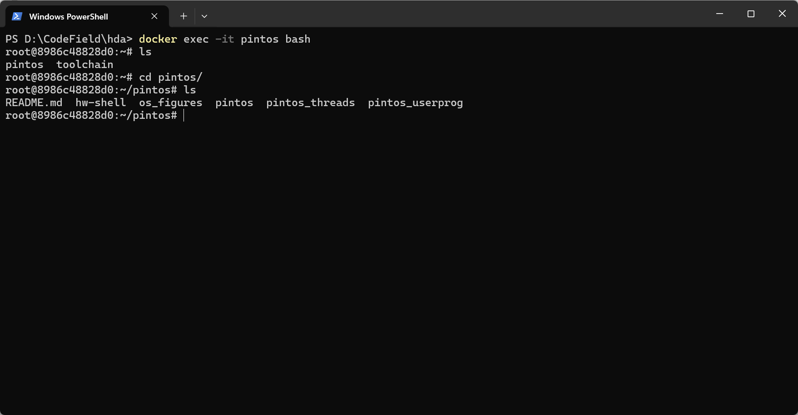

### （二）配置开发环境

#### Pintos介绍

Pintos是由斯坦福大学开发的教学操作系统，旨在帮助学生理解操作系统的基本原理。作为一个小型、简洁的操作系统框架，Pintos包含了线程管理、用户程序执行、虚拟内存和文件系统等核心功能，设计目标是简化操作系统的复杂性，便于学习和理解。Pintos主要面向80x86架构，提供了对内核线程、用户程序加载与执行、以及基本文件系统的支持，所有功能的实现都追求简洁和易懂，适合作为操作系统课程的教学工具。

Pintos目录下的各个功能如下表所示：

| 文件夹名   | 主要负责的功能               |
| ---------- | ---------------------------- |
| threads    | 内核的基本代码               |
| userprog   | 程序加载器                   |
| vm         | 虚拟内存管理                 |
| filesys    | 文件系统管理                 |
| device     | IO设备管理                   |
| tests      | 用于测试                     |
| examples   | 例子代码                     |
| lib/kernel | C 标准库以及必要的工具包     |
| lib/user   | 仅包含于Pintos用户程序中的库 |

#### Pintos环境配置

Pintos的开发环境配置相对简单，只需要安装必要的工具和库即可。Pintos的开发环境主要依赖于clang，可以通过包管理器进行安装。在Ubuntu系统上，可以通过以下命令安装Pintos的开发环境：

```
sudo apt-get update
sudo apt-get install clang
```

安装完clang后，在容器中已经完成了环境的配置，可以直接进行代码的编写和编译。

## **Project 1 :  Shell**

--------------------------------

### 实验目标

通过实现一个简单的 Shell（命令行解释器）来加深对操作系统基本功能和系统调用的理解，包括但不限于目录切换、程序执行、路径解析、输入输出重定向以及信号处理。

### 实验内容

#### 任务一：Add support for cd and pwd

Shell 的框架代码包含一个用于“内置”命令的调度程序。每个 shell 都需要支持一些内置命令，这些命令是 shell 本身的函数，而不是外部程序。例如，exit 命令需要作为内置命令实现，因为它退出 shell 本身。到目前为止，所支持的内置程序只有两个：打开帮助菜单和退出 shell。

**需要添加的功能为：** 添加一个新的内置命令 pwd，将当前工作目录打印到标准输出。然后，添加一个新的内置命令 cd，它接受一个参数，即目录路径，并将当前工作目录更改为该目录。

实现流程图如图所示。

<p align="center">
  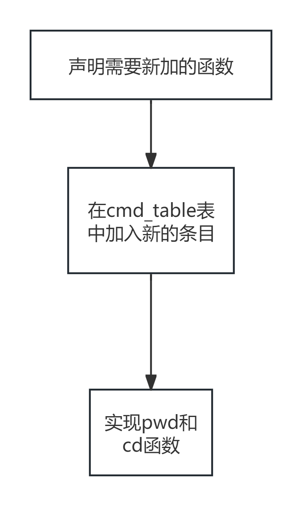
</p>

在 fun_desc_t 结构体数组之前，需要定义这新命令的函数。

```C
int cmd_exit(struct tokens *tokens);
int cmd_help(struct tokens *tokens);
int cmd_pwd(struct tokens *tokens);
int cmd_cd(struct tokens *tokens);
int cmd_run_prog(struct tokens *tokens);
```

在cmd_table数组中添加新的条目，指向新定义的函数。

```C
fun_desc_t cmd_table[] = {
    {cmd_help, "?", "show this help menu"},
    {cmd_exit, "exit", "exit the command shell"},
    {cmd_pwd, "pwd", "current working directory"},
    {cmd_cd, "cd", "change current working directory"}};
```

最后需要实现cmd_pwd和cmd_cd函数。

```C
int cmd_pwd(unused struct tokens *tokens)
{
  char pwd[4096];
  if (getcwd(pwd, sizeof(pwd)) != NULL)
  {
    printf("%s\n", pwd);
  }
  else
  {
    perror("Error getting current working directory!");
  }
  return 0;
}
/* Change the current working directory to the specified path */
int cmd_cd(struct tokens *tokens)
{
  if (tokens_get_length(tokens) != 2)
  {
    printf("cd: destination path required!\n");
    return 1;
  }

  char *path = tokens_get_token(tokens, 1);
  if (chdir(path) != 0)
  {
    perror("Error changing directory!");
    return 1;
  }
  return 0;
}
```

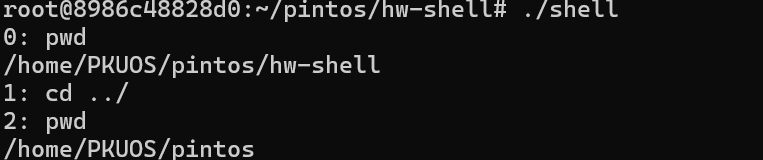


#### 任务二：Program execution

当用户在 shell 中输入一个非内置命令时，shell 会显示一条消息，表示无法执行该程序。为了使 shell 能够执行这些程序，需要对其进行修改。命令的第一个单词是程序名，其余的单词是命令行参数。在这一步中，可以假设命令的第一个单词是程序的完整路径。因此，必须运行/usr/bin/wc，而不是运行wc。

**要求**：当用户输入的命令在cmd_table表中找不到时，shell 无法识别该指令，因此无法运行。需要修改代码，使其能够识别并执行外部程序。

需要修改main函数，当lookup函数查找到指令时，fundex大于0，表示执行cmd_table表中的指令；当fundex小于0时，表示执行用户程序的指令。代码如下所示：

```C
/* Find which built-in function to run. */
int fundex = lookup(tokens_get_token(tokens, 0));

if (fundex >= 0)
    {
    cmd_table[fundex].fun(tokens);
    }
else
    {
    /* REPLACE this to run commands as programs. */
    cmd_run_prog(tokens);
    }
```

cmd_run_prog()函数对应部分如下所示（由于是先写完所有的代码最后再写的报告，所以代码中可能会有一些后续实验用到的东西）。

```C
int cmd_run_prog(struct tokens *tokens){
  int tokens_length = tokens->tokens_length;
  // Check if at least one argument is provided
  if (tokens_length < 1)
  {
    printf("run: At least one command or executable path is required\n");
    return 1;
  }

  // Get the full path of the program
  char *program_path = get_full_path(tokens->tokens[0]);
  if (program_path == NULL)
  {
    printf("File not found!\n");
    return 1;
  }
  // Whether to redirect input/output to file (1 for yes, 0 for no)
  int is_redirected = 0;
  if (tokens_length >= 3)
  {
    // Need to redirect output to file
    if (strcmp(tokens->tokens[tokens_length - 2], ">") == 0)
    {
      is_redirected = 1;
      if (redirect_output(tokens->tokens[tokens_length - 1]) != 0)
      {
        return 1;
      }
    }
    // Need to redirect input from file
    else if (strcmp(tokens->tokens[tokens_length - 2], "<") == 0)
    {
      is_redirected = 1;
      if (redirect_input(tokens->tokens[tokens_length - 1]) != 0)
      {
        return 1;
      }
    }
  }
}
```

结果演示如下图所示，可以在 shell 中执行程序，观察其输出结果：

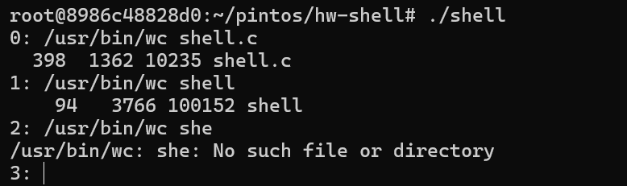

#### 任务三：Path resolution

在之前的部分中，会发现测试 shell 是一件非常麻烦的事情，因为每次都必须输入程序的完整路径。然而，实际上每个程序（包括 shell 程序）都可以访问一组环境变量，这些环境变量的结构是从字符串键到字符串值的哈希表。其中一个重要的环境变量是 PATH 变量。当 bash 或其他任何 shell 执行类似 wc 的程序时，它会在 PATH 环境变量指定的每个目录中查找名为“wc”的程序，并运行找到的第一个匹配程序。路径中的目录用冒号分隔。

**要求**：修改 shell，使其能够使用环境中的 PATH 变量来解析程序名。同时，仍然要支持输入可执行文件的完整路径名。注意不要使用 execvp。

当用户输入的路径不是完整的绝对路径时，shell 需要访问系统中的环境变量来进行查找。在 Linux 中，可以通过输入以下代码来查看环境变量：

```c
echo $PATH  
```

为了解决这个问题，整体流程图如下所示：
<p align="center">
  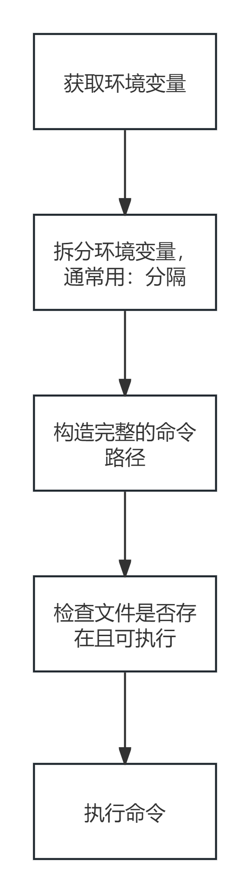
</p>

编写一个函数，使得在执行上一个任务的函数之前，用户输入的路径能够被正确解析。代码如下所示：

```C
// Return the full path, we need to ensure the returned path exists
char *get_full_path(const char *input_path)
{
  if (input_path == NULL)
  {
    return NULL;
  }
  // Check if the path exists (starts with /)
  if (input_path[0] == '/')
  {
    if (access(input_path, F_OK) != -1)
    {
      // Return the path
      return strdup(input_path);
    }
    else
    {
      return NULL;
    }
  }
  // Search for the first possible path based on environment variables
  else
  {
    char *env_path = getenv("PATH");
    if (env_path == NULL)
    {
      // Environment variable does not exist
      return NULL;
    }
    // Copy the environment variable
    char *env_path_copy = strdup(env_path);
    if (env_path_copy == NULL)
    {
      // Memory allocation failed
      perror("Memory allocation failed");
      exit(EXIT_FAILURE);
    }
    // Split the environment variable by :
    char *path = strtok(env_path_copy, ":");
    // Match based on the environment variable path
    while (path != NULL)
    {
      // Allocate space for the full path
      size_t path_length = strlen(path) + strlen(input_path) + 2;
      char *full_path = (char *)malloc(path_length);
      if (full_path == NULL)
      {
        perror("Memory allocation failed");
        exit(EXIT_FAILURE);
      }
      // Concatenate to get the full path
      snprintf(full_path, path_length, "%s/%s", path, input_path);
      // If the first existing path is found
      if (access(full_path, F_OK) != -1)
      {
        free(env_path_copy);
        char *result = strdup(full_path);
        if (result == NULL)
        {
          perror("Memory allocation failed");
          exit(EXIT_FAILURE);
        }
        free(full_path);
        return result;
      }
      // Need to free the full path
      free(full_path);
      // Get the next environment variable
      path = strtok(NULL, ":");
    }
    // If no path is found under all environment variables
    free(env_path_copy);
    return NULL;
  }
}
```

最后我们可以直接输入命令名来执行程序，而不需要输入完整的路径来执行程序，如下图所示

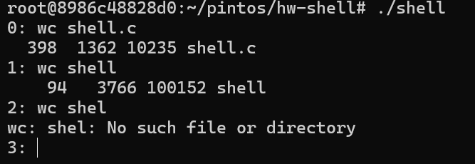

#### 任务四：Input/Output Redirection

当运行程序时，有时需要从文件中读取输入或将输出写入文件。使用语法“[process] > [file]”可以将进程的标准输出重定向到文件。类似地，使用语法“[process] < [file]”可以将文件的内容作为进程的标准输入。

为了使shell支持将stdin和stdout重定向到文件，我们需要进行以下修改。请注意，shell内置命令不需要支持重定向，同时也不需要支持stderr重定向或附加到文件（例如“[process] >> [file]”）。可以假设特殊字符<和>周围总是有空格。此外，“< [file]”或“> [file]”不会作为参数传递给程序。

首先，我们需要判断是否需要重定向输入或输出。判断代码如下所示：

```C

 // Whether to redirect input/output to file (1 for yes, 0 for no)
  int is_redirected = 0;
  if (tokens_length >= 3)
  {
    // Need to redirect output to file
    if (strcmp(tokens->tokens[tokens_length - 2], ">") == 0)
    {
      is_redirected = 1;
      if (redirect_output(tokens->tokens[tokens_length - 1]) != 0)
      {
        return 1;
      }
    }
    // Need to redirect input from file
    else if (strcmp(tokens->tokens[tokens_length - 2], "<") == 0)
    {
      is_redirected = 1;
      if (redirect_input(tokens->tokens[tokens_length - 1]) != 0)
      {
        return 1;
      }
    }
  }
```

接着再编写输入输出重定向的函数，代码如下所示。
输入重定向：

```C

 int redirect_input(char *file_path)
{
  if (file_path == NULL)
  {
    perror("Missing file path parameter!");
    return 1;
  }
  // Open the file, should report an error if it doesn't exist
  FILE *file = fopen(file_path, "r");
  if (file == NULL)
  {
    perror("Error opening file!");
    return 1;
  }
  if (freopen(file_path, "r", stdin) == NULL)
  {
    perror("Failed to redirect standard input to file!");
    fclose(file);
    return 1;
  }
  return 0;
}
```

输出重定向：

```C
int redirect_output(char *file_path)
{
  if (file_path == NULL)
  {
    perror("Missing file path parameter!");
    return 1;
  }
  // Open the file, create it if it doesn't exist
  FILE *file = fopen(file_path, "w");
  if (file == NULL)
  {
    perror("Error opening file!");
    return 1;
  }
  if (freopen(file_path, "w", stdout) == NULL)
  {
    perror("Failed to redirect standard output to file!");
    fclose(file);
    return 1;
  }
  return 0;
}

```

最后需要把输入输出重定向回到标准的输入和输出，不然会引起错误。代码如下所示。

```C
int reset_stdio(){
  freopen("/dev/tty", "w", stdout);
  freopen("/dev/tty", "r", stdin);
  return 0;
}
```

#### 任务五：Signal Handling and Terminal Control

大多数 shell 允许通过特殊按键来停止或暂停进程。这些特殊按键如 Ctrl-C/Z，通过向 shell 的子进程发送信号来工作。如，按 Ctrl-C 发送 SIGINT 信号，通常会停止当前程序；按 Ctrl-Z 发送 SIGTSTP 信号，通常会将当前程序暂停并发送到后台。如果信号直接发送到 shell 进程本身，这不是我们想要的，因为这会导致 shell 子进程停止时，shell 本身也会停止。我们希望这些信号只影响 shell 创建的子进程。

**进程组**：每个进程都有一个唯一的进程 ID (pid)。每个进程还有一个（可能是非唯一的）进程组 ID (pgid)，默认情况下，它与父进程的 pgid 相同。进程可以使用 getpgid()、setpgid()、getpgrp() 或 setpgrp() 来获取和设置它们的进程组 ID。当 shell 启动一个新程序时，该程序可能需要多个进程才能正确运行。所有这些进程将继承原始进程的相同进程组 ID。因此，将每个 shell 子进程放在其自己的进程组中可能是一个好主意。将每个子进程移动到它自己的进程组中时，pgid 应该等于 pid。

**前台终端**：每个终端都有一个关联的“前台”进程组 ID。当键入 Ctrl-C 时，终端会向前台进程组中的每个进程发送一个信号。你可以用 "tcsetpgrp(int fd, pid_t pgrp)" 来改变哪个进程组在终端的前台。fd 对于“标准输入”应该是 0。

**信号概述**：信号是传递给进程的异步消息。它们通过信号号来识别，但也有一些比较人性化的名称，这些名称都以 SIG 开头。

- SIGINT - 当你按下 Ctrl-C 时发送。默认情况下，这会停止程序。
- SIGQUIT - 当你按下 Ctrl-\ 时发送。默认情况下，这也会停止程序，但程序对这个信号的处理比 SIGINT 更加严肃。这个信号还会尝试在退出前生成程序的核心转储。
- SIGKILL - 没有键盘快捷键可以发送这个信号。这个信号会强制停止程序，且无法被程序覆盖（大多数其他信号可以被程序忽略）。
- SIGTSTP - 当你按下 Ctrl-Z 时发送。默认情况下，这会暂停程序。在 bash 中，如果你按下 Ctrl-Z，当前程序会被暂停，bash 会开始接受更多命令。
- SIGCONT - 当你在 bash 中运行 fg 或 fg %NUMBER 时发送。这个信号会恢复一个暂停的程序。
- SIGTTIN - 当一个后台进程尝试从键盘读取输入时发送。默认情况下，这会暂停程序，因为后台进程无法从键盘读取输入。当你用 SIGCONT 恢复后台进程并将其放到前台时，它可以再次尝试从键盘读取输入。
- SIGTTOU - 当一个后台进程尝试向终端控制台写入输出，但有另一个前台进程正在使用终端时发送。默认情况下，它的行为与 SIGTTIN 相同。

在 shell 中，可以使用 "kill -XXX PID" 向进程 ID 为 PID 的进程发送任何信号。例如，"kill -TERM PID" 向进程 ID 为 PID 的进程发送一个 SIGTERM。

在 C 语言中，你可以使用 signal 函数来改变当前进程处理信号的方式。shell 基本上应该忽略大多数这些信号，而 shell 的子进程应该响应默认操作。例如，shell 应该忽略 SIGTTOU，但是子进程不应该。

**要求**：确保你启动的每个程序都在其自己的进程组中。当你启动一个进程时，它的进程组应该放置在前台。停止信号应该只影响前台程序，而不影响后台 shell。

<p align="center">
  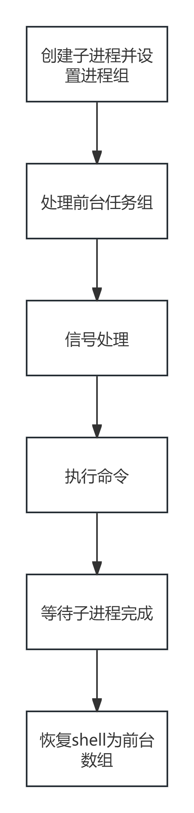
</p>

为了完成此任务，先分析流程。画出的流程图如上图所示。

首先，通过fork()函数创建一个子进程。在子进程中（fork()返回0），设置子进程的进程组，改变对某些信号的默认处理方式，根据输入参数准备一个参数数组，并使用execv执行一个新的程序。如果execv执行失败，则打印错误信息并退出。
在父进程中（fork()返回子进程的PID），忽略SIGINT信号，将子进程置于前台运行，等待子进程完成，然后将控制权回归到父进程。如果有输入输出重定向，则在创建参数数组时排除了重定向相关的参数，并且在子进程和父进程结束后调用reset_stdio来恢复标准输入输出状态。
代码如下所示：

```C
  // Create child process
  pid_t pid = fork();
  if (pid == -1)
  {
    perror("Failed to create child process!");
    return 1;
  }
  else if (pid == 0)
  {
    // Set the process group of the child process, both parameters are 0 to set pgid to the same value as its pid
    setpgid(0, 0);
    // Put the child process in the foreground, the second parameter is pgid, which is equal to pid
    // Set the child process to default behavior for Ctrl-C and Ctrl-Z signals.
    signal(SIGINT, SIG_DFL);
    signal(SIGTSTP, SIG_DFL);
    signal(SIGTTOU, SIG_DFL);
    int new_argc = tokens->tokens_length;
    if (is_redirected == 1) // If input/output redirection is used, do not pass the last two arguments
      new_argc = new_argc - 2;
    char **argv = malloc((new_argc + 1) * sizeof(char *));
    if (argv == NULL)
    {
      perror("Memory allocation failed!\n");
      return 1;
    }
    // Copy strings from tokens
    for (size_t i = 0; i < new_argc; ++i)
    {
      argv[i] = tokens->tokens[i];
    }
    // Place NULL terminator at the end of the array
    argv[new_argc] = NULL;
    // Execute the program in the child process.
    execv(program_path, argv);
    perror("Error executing child process!");
    exit(EXIT_FAILURE);
  }
  // fork returns a positive number, indicating the current process is the parent process, and pid is the id of the child process
  else
  {
    signal(SIGINT, SIG_IGN);
    // Put the child process in the foreground
    tcsetpgrp(shell_terminal, pid);
    int status;
    waitpid(pid, &status, 0);
    tcsetpgrp(shell_terminal, shell_pgid);
    signal(SIGINT, SIG_DFL);
    // Redirect input and output back to the terminal
    reset_stdio();
  }
  reset_stdio();
  return 0;

```

到这里，shell部分的工作已经告一段落，并且在判题机上成功获得了9分的成绩，如下图所示：


### Shell实验总结

通过实现shell，我逐渐理解了命令行的工作原理。尽管表面上它只是一个黑色窗口，但其背后的代码却相当复杂。在这个过程中，我遇到了许多挑战，例如最初的重定向失败和环境变量代码无效等问题。经过几天的研究和查找资料，我终于解决了这些问题。这次实验让我收获颇丰，不仅学会了许多系统调用的功能，还了解了如何实现环境变量，解决了输入输出重定向，并掌握了进程组的概念。希望在接下来的实验中继续努力，取得更好的成绩。

## **Project 2 : Thread**

### 实验过程

#### 任务一：Efficient Alarm Clock

`timer_sleep()` 对于需要实时操作的线程非常有用，例如每秒闪烁一次光标。然而，当前的 `timer_sleep()` 实现效率较低，因为它通过循环调用 `thread_yield()` 来等待足够的时间过去。这种方法在线程等待时会消耗大量的 CPU 周期。

**要求**：重新实现 `timer_sleep()`，使其能够高效地执行，而不需要任何“忙等待”。

由于线程在 CPU 就绪队列和运行队列之间不断切换，占用了 CPU 资源，导致了忙等待现象，因此我们需要修改代码来解决这个问题。

解决此问题的流程图如下所示。

<p align="center">
  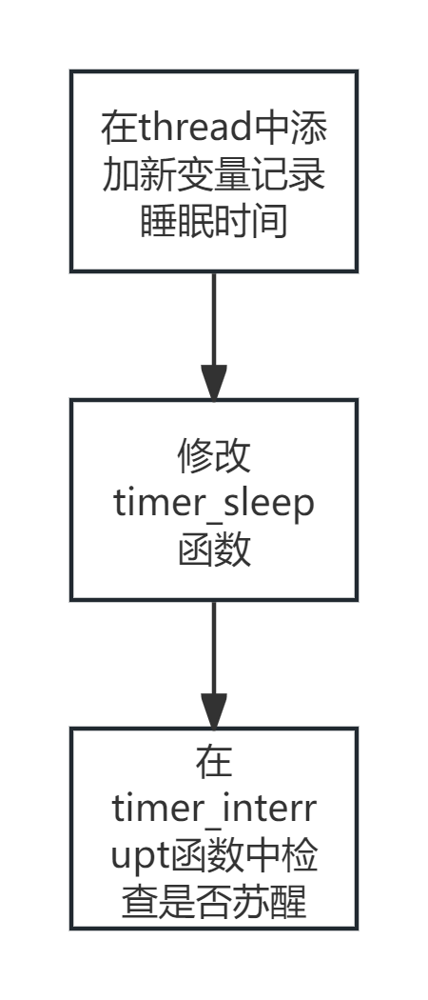
</p>

首先，需要在 `thread.h` 文件中对 `thread` 结构体进行修改，添加一个新的成员变量，用于记录线程的睡眠时间。这个变量将帮助在实现高效的 `timer_sleep()` 函数时，跟踪每个线程的睡眠时间。代码如下所示：

```c
struct thread {
  ...
  int64_t sleep_ticks; //   To track the sleep time of each thread
  ...
};
```

在初始化线程时，还需要确保这个新添加的成员变量被正确地初始化为0。这样可以确保在任何线程开始运行之前，其睡眠时间都是从零开始计算的。初始化代码如下：

```c
void init_thread(struct thread *t, const char *name, int priority) {
  ...
  t->sleep_ticks = 0; // initialize sleep_ticks to 0
  ...
}
```

通过上述修改，已经为实现高效的 `timer_sleep()` 函数打下了坚实的基础。接下来，将继续完善 `timer_sleep()` 函数，使其能够利用新添加的成员变量来避免忙等待，从而显著提高系统的整体效率。

```C
struct thread{
  int64_t sleep_ticks;
};
```

```C
t->sleep_ticks = 0;
```

2. 修改 `timer_sleep()` 函数，使其在调用时直接将当前线程阻塞，并使用上一步定义的变量来记录阻塞的时间。以下是 `timer_sleep` 函数的代码：

```C
void timer_sleep(int64_t ticks) {
  hierarchical_scheduling = false; // Initialize as false.
  if (ticks <= 0)
    return;                   // If ticks <= 0, return immediately.
  else if (ticks >= 200000) { // If ticks >= 200000, use hierarchical scheduling.
    hierarchical_scheduling = true;
    ticks = 20000; // Set to 20000 ticks as the minimum unit for hierarchical scheduling.
  }

  ASSERT(intr_get_level() == INTR_ON);
  enum intr_level old_level = intr_disable();

  struct thread* current_thread = thread_current();
  current_thread->sleep_ticks = ticks;
  thread_block();

  intr_set_level(old_level);
}

```

3. 在 `timer_interrupt` 时钟中断处理函数中，使用 `thread_foreach` 函数（该函数的作用是对所有线程执行某个操作）来检查是否需要将线程放入就绪队列。以下是 `timer_interrupt` 函数的代码：

```C
/* Timer interrupt handler. */
static void timer_interrupt(struct intr_frame* args UNUSED) {
  ticks++;       // Increment the tick count
  thread_tick(); // Update the thread tick

  // Unblock threads whose sleep time has expired
  thread_foreach(unblock_timeup_thread, NULL);
  ...
}
```

4. `unblock_timeup_thread` 函数的作用是检查线程的 `sleep_ticks` 是否已经变为 0，如果是，则将该线程放入就绪队列；如果不是，则继续减一。以下是该函数的代码：

```C
/*Check the blocked threads and unblock them if the blocking time has passed*/
void unblock_timeup_thread(struct thread* t, void* aux UNUSED) {
  if (t->status == THREAD_BLOCKED && t->sleep_ticks > 0) {
    t->sleep_ticks--;
    if (t->sleep_ticks == 0) {
      thread_unblock(t);
    }
  }
}
```

通过上述几处代码的修改，Efficient Alarm 已经完成，成功利用唤醒机制来防止进程的忙等待。

#### 任务二：Priority Scheduler

**介绍**：在Pintos操作系统中，每个线程都有一个从0 (PRI_MIN)到63 (PRI_MAX)的优先级值。然而，当前的调度器并没有按照这些优先级值来调度线程。

**要求**：

- 修改调度器，使得高优先级线程总是优先于低优先级线程运行（即严格的优先级调度）。同时，还需要修改Pintos中的三个同步原语（锁、信号量、条件变量），以确保这些共享资源优先被高优先级线程使用。
- 此外，还需要为Pintos锁实现优先级捐赠。当高优先级线程（A）必须等待一个由低优先级线程（B）持有的锁时，需要临时将B的优先级提升到A的优先级。这是为了避免优先级反转的问题，即当一个中优先级线程运行时，一个高优先级线程（A）正在等待一个低优先级线程（B）持有的资源。支持优先级捐赠的调度器将允许B首先运行，以便最高优先级的A可以被解除阻塞。优先级捐赠的实现必须处理以下情况：
  - 来自多个来源的捐赠，
  - 当锁被释放时撤销捐赠，
  - 嵌套/递归捐赠。

线程可以通过调用 thread_set_priority(int new_priority) 来设置自己的优先级，也可以通过调用 thread_get_priority() 来获取自己的优先级。如果一个线程不再拥有最高的“有效优先级”（例如，它调用 thread_set_priority() 设置了一个较低的值，或者它释放了一个锁），它必须立即将CPU让给最高优先级的线程。

1. 首先实现优先级队列

在原先的代码中，thread_unblock函数是直接将线程放到就绪队列的队尾，这样无法实现优先级调度。因此，需要修改代码，使得就绪队列变成一个优先级队列。

基代码中已经提供了list_insert_ordered这个函数，可以自动将线程插入到优先级队列中。因此，只需要在thread_enqueue函数中使用list_insert_ordered函数，将线程插入到就绪队列中即可。
```C
void list_insert_ordered(struct list* list, struct list_elem* elem, list_less_func* less,
                         void* aux) {
  struct list_elem* e;

  ASSERT(list != NULL);
  ASSERT(elem != NULL);
  ASSERT(less != NULL);

  for (e = list_begin(list); e != list_end(list); e = list_next(e))
    if (less(elem, e, aux))
      break;
  return list_insert(e, elem);
}
```

接下来，我们需要实现一个比较线程优先级的函数 `cmp_priority_thread`，代码如下所示：

```C
bool cmp_priority_thread(const struct list_elem* a, const struct list_elem* b, void* aux UNUSED) {
  return list_entry(a, struct thread, elem)->priority >
         list_entry(b, struct thread, elem)->priority;
}
```

至此，优先级队列的实现已经完成。

2. 实现抢占式调度

在设置一个线程的优先级时，需要立即重新安排所有线程的执行顺序。因此，在设置优先级时，需要判断当前线程的优先级大小，并决定是否需要让出CPU。代码如下所示：

```C
/* Sets the current thread's priority to NEW_PRIORITY. */
void thread_set_priority(int new_priority) {
  if (active_sched_policy == SCHED_FAIR)
    return;

  enum intr_level old_level = intr_disable();

  struct thread* current_thread = thread_current();
  int old_priority = current_thread->priority;
  current_thread->original_priority = new_priority;

  if (list_empty(&current_thread->held_locks) || new_priority > old_priority) {
    current_thread->priority = new_priority;
    thread_yield();
  }

  intr_set_level(old_level);
}
```

同时，当创建一个进程时，如果当前进程的优先级比主进程低，也要让出CPU。在 `thread_create` 函数中新增的代码如下所示：

```C
  if (thread_current()->priority < priority) {
    // If priority of the current thread is lower than the priority of the new one.
    thread_yield();
  }
```

3. 实现进程优先级同步

每次运行的进程释放信号量时，都必须确保进程按照优先级顺序来运行。然而，原本的代码中只是取出了最头部的元素，而不是优先级最高的元素。因此，需要修改 `P` 和 `V` 的代码。修改后的 `sema_down` 代码如下所示：

```C
/* Down or "P" operation on a semaphore.  Waits for SEMA's value
   to become positive and then atomically decrements it.

   This function may sleep, so it must not be called within an
   interrupt handler.  This function may be called with
   interrupts disabled, but if it sleeps then the next scheduled
   thread will probably turn interrupts back on. */
void sema_down(struct semaphore* sema) {
  enum intr_level old_level;

  ASSERT(sema != NULL);
  ASSERT(!intr_context());

  old_level = intr_disable();
  while (sema->value == 0) {
    list_insert_ordered(&sema->waiters, &thread_current()->elem, cmp_priority_thread, NULL);
    thread_block();
  }
  sema->value--;
  intr_set_level(old_level);
}
```

修改后的 `sema_up` 操作代码如下所示：

```C
/* Up or "V" operation on a semaphore.  Increments SEMA's value
   and wakes up one thread of those waiting for SEMA, if any.

   This function may be called from an interrupt handler. */
void sema_up(struct semaphore* sema) {
  enum intr_level old_level;

  ASSERT(sema != NULL);

  old_level = intr_disable();
  if (!list_empty(&sema->waiters)) {
    list_sort(&sema->waiters, cmp_priority_thread, NULL);
    thread_unblock(list_entry(list_pop_front(&sema->waiters), struct thread, elem));
  }
  sema->value++;
  if (intr_context()) {
    intr_yield_on_return();
  } else {
    thread_yield();
  }
  intr_set_level(old_level);
}
```

接着修改 `cond_signal` 函数，使得等待 `cond` 的线程队列可以根据优先级排序。

```C
/* 如果有线程在 COND 上等待（由 LOCK 保护），那么此函数会发出信号唤醒其中一个线程。
   在调用此函数之前必须持有 LOCK。

   中断处理程序不能获取锁，因此在中断处理程序中尝试发出条件变量信号是没有意义的。 */
void cond_signal(struct condition *cond, struct lock *lock UNUSED) {
  ASSERT(cond != NULL);
  ASSERT(lock != NULL);
  ASSERT(!intr_context());
  ASSERT(lock_held_by_current_thread(lock));

  if (!list_empty(&cond->waiters)) {
    list_sort(&cond->waiters, cond_sema_cmp_priority, NULL);
    sema_up(&list_entry(list_pop_front(&cond->waiters), struct semaphore_elem, elem)->semaphore);
  }
}
```

最后，增加一个 `cond_sema_cmp_priority` 函数，用于返回按照顺序排好的队列（降序）。

```C
bool cond_sema_cmp_priority(const struct list_elem *a, const struct list_elem *b, void *aux) {
  struct semaphore_elem *sa = list_entry(a, struct semaphore_elem, elem);
  struct semaphore_elem *sb = list_entry(b, struct semaphore_elem, elem);
  return list_entry(list_front(&sa->semaphore.waiters), struct thread, elem)->priority > list_entry(list_front(&sb->semaphore.waiters), struct thread, elem)->priority;
}
```

4. 实现优先级捐赠

在操作系统中，当一个低优先级线程持有某个临界资源的锁，而高优先级线程需要访问该资源时，会出现优先级翻转问题。为了解决这个问题，需要实现优先级捐赠机制。

具体的代码实现如下：

首先，需要在 `thread` 和 `lock` 数据结构中添加必要的属性。在 `thread` 结构体中，增加基础优先级、线程拥有的锁列表以及线程正在等待的锁，并在 `init_thread` 函数中对它们进行初始化。

```C
struct thread {
  /* 线程结构体定义 */
  ...
  int original_priority;     // 基本优先级
  struct list held_locks;    // 当前线程持有的锁列表
  struct lock* lock_waiting; // 线程正在等待的锁
  ...
};
```

```C
  void init_thread(struct thread *t, const char *name, int priority) {
    ...
    t->original_priority = priority;
    list_init(&t->held_locks);
    t->lock_waiting = NULL;
    ...
  }
```

在 `lock` 结构体中，增加用于优先级捐赠的队列和最高线程优先级。

```C
struct lock {
  ...
  struct list_elem elem;      /* Priority Donation List Elements. */
  int max_priority;
  ...
};
```

接下来，需要修改 `lock_acquire` 函数，实现优先级捐赠，并在线程获得锁之后成为该锁的拥有者。

```C
void lock_acquire(struct lock* lock) {
  struct thread* current_thread = thread_current();
  struct lock* l;
  enum intr_level old_level;

  ASSERT(lock != NULL);
  ASSERT(!intr_context());
  ASSERT(!lock_held_by_current_thread(lock));

  if (lock->holder != NULL && active_sched_policy != SCHED_FAIR) {
    current_thread->lock_waiting = lock;
    l = lock;
    while (l != NULL && current_thread->priority > l->max_priority) {
      l->max_priority = current_thread->priority;
      thread_priority_donation(l->holder);
      l = l->holder->lock_waiting;
    }
  }

  sema_down(&lock->semaphore);

  old_level = intr_disable();

  current_thread = thread_current();
  if (active_sched_policy != SCHED_FAIR) {
    current_thread->lock_waiting = NULL;
    lock->max_priority = current_thread->priority;
    thread_hold_the_lock(lock);
  }
  lock->holder = current_thread;

  intr_set_level(old_level);
}
```

同时，需要实现 `thread_priority_donation` 和 `thread_hold_the_lock` 这两个函数。具体代码如下：

```C
/*Adjust the priority of the thread and reinsert it into the ready queue*/
void thread_priority_donation(struct thread* t) {
  enum intr_level old_level = intr_disable();
  thread_priority_renewal(t);

  // If the thread state is THREAD_READY, otherwise, its statu is THREAD_RUNNING
  if (t->status == THREAD_READY) {
    list_remove(&t->elem);
    list_insert_ordered(&fifo_ready_list, &t->elem, cmp_priority_thread, NULL);
  }

  intr_set_level(old_level);
}
```

```C
/*A thread holds (acquires) a lock*/
void thread_hold_the_lock(struct lock* lock) {
  enum intr_level old_level = intr_disable();

  list_insert_ordered(&thread_current()->held_locks, &lock->elem, cmp_priority_lock, NULL);
 
  // If the priority of the lock is higher than the current thread's priority
  if (lock->max_priority > thread_current()->priority) {
    thread_current()->priority = lock->max_priority;
    thread_yield();
  }
  // Restore the previously saved interrupt level
  intr_set_level(old_level);
}
```

为了比较锁的优先级，需要实现一个优先级比较函数 `cmp_priority_lock`：

```C
/*A function that compares the priority of two locks, 
  used for ` list_ The sort ` function performs sorting operations.
  Return value: Returns true when the priority of the first lock is greater than that of the second lock*/
bool cmp_priority_lock(const struct list_elem* a, const struct list_elem* b, void* aux UNUSED) {
  return list_entry(a, struct lock, elem)->max_priority >
         list_entry(b, struct lock, elem)->max_priority;
}
```

接着，修改 `lock_release` 函数来进行锁的释放操作。

```C
/* Releases LOCK, which must be owned by the current thread.

   An interrupt handler cannot acquire a lock, so it does not
   make sense to try to release a lock within an interrupt
   handler. */

void lock_release(struct lock* lock) {
  ASSERT(lock != NULL);
  ASSERT(lock_held_by_current_thread(lock));

  // new
  if (active_sched_policy != SCHED_FAIR) {
    thread_remove_lock(lock);
  }

  lock->holder = NULL;
  sema_up(&lock->semaphore);
}
```

然后，实现 `thread_remove_lock` 函数，代码如下：

```C
// 从锁列表中移除指定的锁
void thread_remove_lock(struct lock* lock) {
  enum intr_level old_level = intr_disable();

  list_remove(&lock->elem);
    
  thread_priority_renewal(thread_current());

  intr_set_level(old_level);
}
```

最后，编写 `thread_update_priority` 函数，用于更新线程的优先级。如果线程拥有锁，则获取这些锁的最大优先级，并根据需要更新被捐赠的优先级。具体代码如下：

```C
/* Update the priority of threads and adjust
  it based on the priority of the locks they hold*/

void thread_priority_renewal(struct thread* t) {
  enum intr_level old_level = intr_disable();
  int reasonable_priority = t->original_priority; // Initialize maximum priority to basic priority
  int max_lock_priority;                          // Priority used to store locks

  if (!list_empty(&t->held_locks)) {
      
    //Sort the lock list based on the maximum priority of the lock
    list_sort(&t->held_locks, cmp_priority_lock, NULL);
    max_lock_priority = list_entry(list_front(&t->held_locks), struct lock, elem)->max_priority;
    if (max_lock_priority > reasonable_priority)
      reasonable_priority = max_lock_priority;
  }

  //Set the priority of the thread to the maximum
  //priority value and store it in the thread structure
  t->priority = reasonable_priority;
  intr_set_level(old_level);
}
```

至此，优先级捐赠的实现已经基本完成。

#### 任务三：Advanced Scheduler  

**如何实现不同的调度方式**
在本实验的代码中，有四种调度方式可以选择，分别是先进先出、优先级调度、公平调度和多级反馈队列调度。它们的定义如下：

```C
/* Types of scheduler that the user can request the kernel
 * use to schedule threads at runtime. */

enum sched_policy {
  SCHED_FIFO,  // First-in, first-out scheduler
  SCHED_PRIO,  // Strict-priority scheduler with round-robin tiebreaking
  SCHED_FAIR,  // Implementation-defined fair scheduler
  SCHED_MLFQS, // Multi-level Feedback Queue Scheduler
};
```

通过active_sched_policy这个变量来决定当前使用哪一种调度方式：

```C
/* Determines which scheduler the kernel should use.
   Controlled by the kernel command-line options
    "-sched=fifo", "-sched=prio",
    "-sched=fair". "-sched=mlfqs"
   Is equal to SCHED_FIFO by default. */
enum sched_policy active_sched_policy;
```

在调度时，通过调度函数选择不同的调度方式。调度函数表如下：

```C
/* Jump table for dynamically dispatching the current scheduling
   policy in use by the kernel. */

scheduler_func* scheduler_jump_table[8] = {thread_schedule_fifo,     thread_schedule_prio,
                                           thread_schedule_fair,     thread_schedule_mlfqs,
                                           thread_schedule_reserved, thread_schedule_reserved,
                                           thread_schedule_reserved, thread_schedule_reserved};
```

为了实现多级反馈队列调度，首先需要确定解决问题的流程，流程图如下所示：
<p align="center">
  
</p>


我们需要根据公式计算出进程的优先级，从而让系统选择高优先级的进程进行调度。但是Pintos没有浮点运算逻辑，所以需要手动实现。实现代码如下：

```C
#ifndef __THREAD_FIXED_POINT_H
#define __THREAD_FIXED_POINT_H
/* Basic definition of fixed-point numbers. */
typedef int fixed_t;
/* 16 least significant bits are used for the fractional part. */
#define CAL_FIXED_POINT_SHIFT_AMOUNT 16
/* Convert a value to a fixed-point value. */
#define CAL_FIXED_POINT_CONST(A) ((fixed_t)(A << CAL_FIXED_POINT_SHIFT_AMOUNT))
/* Add two fixed-point values. */
#define CAL_FIXED_POINT_ADD(A,B) (A + B)
/* Add a fixed-point value A and an integer value B. */
#define CAL_FIXED_POINT_ADD_MIX(A,B) (A + (B << CAL_FIXED_POINT_SHIFT_AMOUNT))
/* Subtract two fixed-point values. */
#define CAL_FIXED_POINT_SUB(A,B) (A - B)
/* Subtract an integer value B from a fixed-point value A. */
#define CAL_FIXED_POINT_SUB_MIX(A,B) (A - (B << CAL_FIXED_POINT_SHIFT_AMOUNT))
/* Multiply a fixed-point value A by an integer value B. */
#define CAL_FIXED_POINT_MULT_MIX(A,B) (A * B)
/* Divide a fixed-point value A by an integer value B. */
#define CAL_FIXED_POINT_DIV_MIX(A,B) (A / B)
/* Multiply two fixed-point values. */
#define CAL_FIXED_POINT_MULT(A,B) ((fixed_t)(((int64_t) A) * B >> CAL_FIXED_POINT_SHIFT_AMOUNT))
/* Divide two fixed-point values. */
#define CAL_FIXED_POINT_DIV(A,B) ((fixed_t)((((int64_t) A) << CAL_FIXED_POINT_SHIFT_AMOUNT) / B))
/* Get the integer part of a fixed-point value. */
#define CAL_FIXED_POINT_INT_PART(A) (A >> CAL_FIXED_POINT_SHIFT_AMOUNT)
/* Get the rounded integer of a fixed-point value. */
#define CAL_FIXED_POINT_ROUND(A) (A >= 0 ? ((A + (1 << (CAL_FIXED_POINT_SHIFT_AMOUNT - 1))) >> CAL_FIXED_POINT_SHIFT_AMOUNT) \
        : ((A - (1 << (CAL_FIXED_POINT_SHIFT_AMOUNT - 1))) >> CAL_FIXED_POINT_SHIFT_AMOUNT))
/* Left shift a fixed-point value A by B bits. */
#define CAL_FIXED_POINT_MULT_2(A,B) (A << B)
/* Right shift a fixed-point value A by B bits. */
#define CAL_FIXED_POINT_DIV_2(A,B) (A >> B)
/* Bitwise XOR of fixed-point values A and B. */
#define CAL_FIXED_POINT_63_SUB(A,B) (A ^ B)
/* Left shift a fixed-point value A by B bits and then right shift by CAL_FIXED_POINT_SHIFT_AMOUNT bits. */
#define FIXED_MULT_2_F(A, B) ((fixed_t)(((int64_t)A) << B >> CAL_FIXED_POINT_SHIFT_AMOUNT))
/* Left shift a fixed-point value A by CAL_FIXED_POINT_SHIFT_AMOUNT bits and then divide by B. */
#define CAL_FIXED_POINT_DIV_2_F(A,B) ((fixed_t)((((int64_t) A) << CAL_FIXED_POINT_SHIFT_AMOUNT) / B))
#endif /* threads/fixed-point.h */

```

在添加完浮点数运算逻辑之后，需要对thread结构体添加两个成员，分别是nice和recent_cpu。nice表示当前线程与其他线程之间的友好程度：当nice=0时不会影响线程的优先级，nice越大，线程优先级越低；recent_cpu表示当前每一个进程占用了多少CPU时间。代码如下：

```C
struct thread {
  ...
  int nice;                  // 线程的nice值，影响调度行为
  fixed_t recent_cpu;        // 最近CPU使用时间
  ...
};
```

需要对它们进行初始化，nice初始化为0，recent_cpu初始化为浮点数0(FP_CONST(0))，同时在thread.c中添加load_avg，用于记录系统的平均负载。

做好上述工作之后，首先在lock_acquire、lock_try_acquire、lock_release等函数中添加判断语句，当active_sched_policy不为多级反馈队列时，才可以进行后续操作，否则就跳过不执行。具体的代码已在上面给出。(不知道为什么test里要给schedule_fair,所以我换成了fair调度才能过)

接着在thread.c中添加关键的实现函数update_pri_mlfqs和mlfqs_increase_recent_cpu。

update_pri_mlfqs函数通过对队列的排序后，选取最高的优先级来更新线程的优先级。mlfqs_increase_recent_cpu函数用来更新recent_cpu，对原来的recent_cpu进行浮点加一。具体的代码如下：

```C
// Update thread priority
void update_pri_mlfqs(struct thread* t) {
  ASSERT(active_sched_policy == SCHED_FAIR);
  if (t == idle_thread)
    return;
  /*Whether to use hierarchycal scheduling or not*/
  if (hierarchical_scheduling) {
    t->priority = CAL_FIXED_POINT_INT_PART(
        CAL_FIXED_POINT_SUB_MIX(CAL_FIXED_POINT_SUB(CAL_FIXED_POINT_CONST(PRI_MAX), (CAL_FIXED_POINT_DIV_MIX(t->recent_cpu, 4))), t->nice));
  } else {
    t->priority = CAL_FIXED_POINT_INT_PART(CAL_FIXED_POINT_SUB_MIX(CAL_FIXED_POINT_SUB(CAL_FIXED_POINT_CONST(PRI_MAX), CAL_FIXED_POINT_DIV_MIX(t->recent_cpu, 4)),0));
  }
  /*clamp the priority.*/
  if (t->priority < PRI_MIN)
    t->priority = PRI_MIN;
  else if (t->priority > PRI_MAX)
    t->priority = PRI_MAX;
}
// Update system average load and recent CPU usage
void update_LA_and_RC_mlfqs() {
  ASSERT(active_sched_policy == SCHED_FAIR);
  ASSERT(intr_context());
  // Get the number of ready threads
  size_t ready_cnt = list_size(&fifo_ready_list);
  if (thread_current() != idle_thread)
    ++ready_cnt;
  // Update system average load
  load_avg =
      CAL_FIXED_POINT_ADD(CAL_FIXED_POINT_DIV_MIX(CAL_FIXED_POINT_MULT_MIX(load_avg, 59), 60),
                          CAL_FIXED_POINT_DIV_MIX(CAL_FIXED_POINT_CONST(ready_cnt), 60));
  struct thread* t;
  struct list_elem* e;
  // Traverse all thread lists
  for (e = list_begin(&all_list); e != list_end(&all_list); e = list_next(e)) {
    t = list_entry(e, struct thread, allelem);
    if (t != idle_thread) {
      t->recent_cpu = CAL_FIXED_POINT_ADD_MIX(
          CAL_FIXED_POINT_MULT(
              CAL_FIXED_POINT_DIV(FIXED_MULT_2_F(load_avg, 1), CAL_FIXED_POINT_ADD_MIX(FIXED_MULT_2_F(load_avg, 1), 1)),t->recent_cpu),0);
      update_pri_mlfqs(t);
    }
  }
}
```

同时需要修改timer_interrupt函数，做到每一秒更新一次系统load_avg和所有线程的recent_cpu，每四个ticks更新一次线程优先级，每个tick后运行的线程的recent_cpu增加一。具体代码如下：

```C
static void timer_interrupt(struct intr_frame* args UNUSED) {
  ticks++;       // Increment the tick count
  thread_tick(); // Update the thread tick

  // Unblock threads whose sleep time has expired
  thread_foreach(unblock_timeup_thread, NULL);

  // If the active scheduling policy is SCHED_FAIR
  if (active_sched_policy == SCHED_FAIR) {
    increate_recent_CPU_mlfqs(); // Increase recent CPU for MLFQS

    // Update load average and recent CPU every second
    if (ticks % TIMER_FREQ == 0) {
      update_LA_and_RC_mlfqs();
    }
    // Update priority every 4 ticks
    else if (ticks % 4 == 0) {
      update_pri_mlfqs(thread_current());
    }
  }
}
```

最后更新一下几个空着的函数。

```C
/* Returns the current thread's nice value. */
int thread_get_nice(void) {
  /* Not yet implemented. */
  return thread_current()->nice;
}
  
/* Sets the current thread's nice value to NICE. */
void thread_set_nice(int nice UNUSED) { /* Not yet implemented. */
  thread_current()->nice = nice;
  update_pri_mlfqs(thread_current());
  thread_yield();
}

/* Return 100 times the average system load*/
int thread_get_load_avg(void) {
  /* Not yet implemented. */
  return CAL_FIXED_POINT_ROUND(CAL_FIXED_POINT_MULT_MIX(load_avg, 100));
}

/*Return the current thread recent_ 100 times the CPU value*/
int thread_get_recent_cpu(void) {
  /* Not yet implemented. */
  return CAL_FIXED_POINT_ROUND(CAL_FIXED_POINT_MULT_MIX(thread_current()->recent_cpu, 100));
}
```

为了解决层次调度的问题，需要定义一个变量hierarchical_scheduling来判断是否打开层次调度，层次调度是一种操作系统调度策略，它可以将进程或线程分组，并为每个组分配不同的调度策略或优先级。具体代码如下：

```C
bool hierarchical_scheduling; // Hierarchical scheduling.
```

在代码中，hierarchical_scheduling被用于以下两个方面：

优先级和 Nice 值的初始化：在 init_thread 函数中，根据 hierarchical_scheduling 的值决定如何初始化线程的 nice 值。如果启用层次调度，nice 值会根据线程的优先级或其他标准进行设置，具体代码如下所示：

```C
/* Does basic initialization of T as a blocked thread named
   NAME. */
static void init_thread(struct thread* t, const char* name, int priority) {
  enum intr_level old_level;

  ASSERT(t != NULL);
  ASSERT(PRI_MIN <= priority && priority <= PRI_MAX);
  ASSERT(name != NULL);

  memset(t, 0, sizeof *t);
  t->status = THREAD_BLOCKED;
  strlcpy(t->name, name, sizeof t->name);
  t->stack = (uint8_t*)t + PGSIZE;
  t->priority = priority;
#ifdef USERPROG
  t->pcb = NULL;
#endif
  t->magic = THREAD_MAGIC;
  t->original_priority = priority;
  list_init(&t->held_locks);
  t->lock_waiting = NULL;
  t->ticks = 0;

  if (hierarchical_scheduling) {
    t->nice = 0;
  } else {
    if (priority == 56)
      t->nice = 0;
    else if (priority == 48)
      t->nice = 1;
    else if (priority == 40)
      t->nice = 2;
    else if (priority == 32)
      t->nice = 3;
    else if (priority == 24)
      t->nice = 4;
    else if (priority == 16)
      t->nice = 5;
    else if (priority == 8)
      t->nice = 6;
    else if (priority == 0)
      t->nice = 7;
  }
  t->recent_cpu = CAL_FIXED_POINT_CONST(0);
  old_level = intr_disable();
  list_insert_ordered(&all_list, &t->allelem, (list_less_func*)&cmp_priority_thread, NULL);
  intr_set_level(old_level);
}
```

计算优先级：在 update_pri_mlfqs 函数中，hierarchical_scheduling 影响了线程优先级的计算方式。如果启用了层次调度，线程的优先级会根据其 nice 值和其他因素（如最近的 CPU 使用率）进行调整,具体代码如下；

```C
void update_pri_mlfqs(struct thread* t) {
  ASSERT(active_sched_policy == SCHED_FAIR);

  if (t == idle_thread)
    return;
  /*Whether to use hierarchycal scheduling or not*/
  if (hierarchical_scheduling) {
    t->priority = CAL_FIXED_POINT_INT_PART(
        CAL_FIXED_POINT_SUB_MIX(CAL_FIXED_POINT_SUB(CAL_FIXED_POINT_CONST(PRI_MAX),
                                                    (CAL_FIXED_POINT_DIV_MIX(t->recent_cpu, 4))),t->nice));
  } else {
    t->priority = CAL_FIXED_POINT_INT_PART(
        CAL_FIXED_POINT_SUB_MIX(CAL_FIXED_POINT_SUB(CAL_FIXED_POINT_CONST(PRI_MAX),
                                                    CAL_FIXED_POINT_DIV_MIX(t->recent_cpu, 4)),0));
  }
  /*clamp the priority.*/
  if (t->priority < PRI_MIN)
    t->priority = PRI_MIN;
  else if (t->priority > PRI_MAX)
    t->priority = PRI_MAX;
}
```

最后还需要加一个schedule_started 变量用于控制调度系统的启动，用来指示调度系统何时准备好开始运行和调度线程。

```C
bool schedule_started;
```

在 thread_start 函数中，schedule_started 被设置为 true，表示调度系统已经完成初始化，现在可以开始调度线程。具体代码如下：

```C
/*Start preemptive thread scheduling by enabling interrupts. Idle threads were also created*/
void thread_start(void) {
  /* Create the idle thread. */
  struct semaphore idle_started;
  load_avg = CAL_FIXED_POINT_CONST(0);
  schedule_started = true;
  sema_init(&idle_started, 0);
  thread_create("idle", PRI_MIN, idle, &idle_started);
  /* Start preemptive thread scheduling. */
  intr_enable();
  /* Wait for the idle thread to initialize idle_thread. */
  sema_down(&idle_started);
}
```

在 thread_yield 函数中，代码首先检查 schedule_started 是否为 true。如果为 false，函数直接返回而不进行任何调度操作。只有在调度系统启动（即 schedule_started 为 true）后，线程才会实际参与调度。

```C
/* Yields the CPU.  The current thread is not put to sleep and
   may be scheduled again immediately at the scheduler's whim. */
void thread_yield(void) {
  if (!schedule_started)
    return;
  struct thread* cur = thread_current();
  enum intr_level old_level;

  ASSERT(!intr_context());

  old_level = intr_disable();
  if (cur != idle_thread)
    list_insert_ordered(&fifo_ready_list, &cur->elem, (list_less_func*)&cmp_priority_thread, NULL);
  cur->status = THREAD_READY;
  schedule();
  intr_set_level(old_level);
}
```

`schedule_started` 变量在 `thread_start` 函数中被设置，并在其他调度相关函数中作为条件使用。它的作用是作为一个同步点，确保在所有必要的初始化完成之前，不会执行任何调度操作。

至此，thread部分就已经全部结束了，最终在判题机上的36个测试点已全部pass，并在判题机上取得了37分的成绩，如下图所示


### Thread实验总结

通过完成线程实验，我对Pintos中的线程调度机制有了更深刻的理解。这次实验涉及了许多复杂的知识点，例如时钟中断、优先级调度、多级反馈队列和线程优先级捐赠等。之前在学习这些概念时，我只是停留在理论层面，而在实际编写代码时遇到了许多困难。这不仅耗费了大量时间，还需要不断地调试和修改细节。通过一次次的调试、查找错误和上网查阅资料，最终成功通过了所有测试点。当实验最终完成时，我感到非常有成就感，这也激发了我继续深入研究的决心。我希望在接下来的实验中能够继续努力，取得更好的成绩。

## **Project 3 :  User Programs**

### 实验内容

#### 任务一：Argument Passing
`process_execute(char *file_name)` 函数在 Pintos 中用于创建新的用户级进程。目前，它还不支持命令行参数的传递。因此，需要实现参数传递功能，使得调用 `process_execute("ls -ahl")` 时能够提供两个参数 `["ls", "-ahl"]` 给用户程序，并通过 `argc` 和 `argv` 使用。

许多 Pintos 测试程序在启动时会打印出它们自己的名字（例如 `argv[0]`）。由于参数传递功能尚未实现，这些程序在访问 `argv[0]` 时会崩溃。在实现参数传递之前，这些用户程序将无法正常工作。

为了完成这个任务，需要按照一定的顺序将参数分配到特定的堆栈中。可以先拆分命令名和其他参数，然后将它们传递给指定的函数，并按顺序将它们添加到堆栈中。

参数传递是一个层层递进的过程。首先，复制一份参数后，将参数传递给需要执行的函数（这里是 `start_process`）。然后，`start_process` 函数会继续执行 `load` 函数，在这个函数中会分配用户的地址空间，并将参数传递给 `setup_stack` 函数，创建用户栈并返回 `load`，再对参数进行处理。

`process_execute` 函数的作用是启动一个新线程来运行一个用户程序。新线程可能会在 `process_execute()` 返回之前被调度（甚至可能已经退出）。如果线程创建成功，返回新进程的进程 ID；如果线程无法创建，返回 `TID_ERROR`。代码如下所示：

```C
pid_t process_execute(const char* file_name) {
  char* fn_copy;
  tid_t tid;
  struct thread* t = thread_current();

  /* Make a copy of FILE_NAME.
    Otherwise there's a race between the caller and load(). */
  fn_copy = palloc_get_page(0);
  if (fn_copy == NULL)
   return TID_ERROR;
  strlcpy(fn_copy, file_name, PGSIZE);

  // Allocate space for the child's metadata
  metadata_t* data = (metadata_t*)malloc(sizeof(metadata_t));
  // Set the copy of cmd_line into the metadata structure's element
  data->file_copy = fn_copy;
  // Initialize the semaphore for child process loading, wait until it attempts to load
  sema_init(&(data->load), 0);

  /* Create a new thread to execute FILE_NAME. */
  tid = thread_create(file_name, PRI_DEFAULT, start_process, (void*)data);
  // Call down on child's load semaphore to wait till it's attempted to load
  sema_down(&(data->load));
  if (data->load_check && tid != TID_ERROR) {
   // If loading is successful, add the child process to the parent's child process list and return tid
   list_insert(list_end(t->pcb->child), &(data->elem));
   return tid;
  } else {
   // If not successful, free the allocated metadata and free the copy of cmd_line character pointer
   free(data);
   palloc_free_page(fn_copy);
   return -1;
  }
}
```

`start_process` 函数的主要任务是加载一个用户进程并启动它的执行。这个函数的流程图如下所示：

<p align="center">
  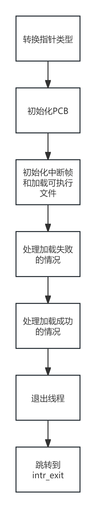
</p>

在这个流程中，首先将传递的参数转换为元数据结构，并将命令行参数保存到 `file_name` 中。接着，初始化进程控制块（PCB），并为新进程分配必要的资源，如文件描述符表和子进程列表。

然后，函数会尝试加载可执行文件。如果加载成功，函数会设置用户栈，并将启动地址设置为可执行文件的入口点。最后，通过模拟从中断返回来启动用户进程。

如果加载失败，函数会释放已分配的资源，并通知等待的父进程子进程已完成。无论加载是否成功，函数都会退出并返回相应的状态。


代码如下所示：

```C
/* A thread function that loads a user process and starts it running. */
static void start_process(void* newmetadata) {
  // Convert the passed void pointer to metadata structure
  metadata_t* data = (metadata_t*)newmetadata;
  // Save the cmd_line passed in metadata to file_name
  char* file_name = (char*)data->file_copy;
  struct thread* t = thread_current();

  struct intr_frame if_;
  bool success, pcb_success;

  /* Allocate process control block */
  struct process* new_pcb = malloc(sizeof(struct process));
  success = pcb_success = new_pcb != NULL;

  /* Initialize process control block */
  if (success) {
   // Ensure timer_interrupt() -> schedule() -> process_activate()
   // does not try to activate our uninitialized pagedir
   new_pcb->pagedir = NULL;
   t->pcb = new_pcb;

   // Continue initializing the PCB as normal
   t->pcb->main_thread = t;
   strlcpy(t->pcb->process_name, t->name, sizeof t->name);

   // Allocate the file_descriptor_table pointer in the PCB
   t->pcb->file_descriptor_table = (file_descriptor_list_t*)malloc(sizeof(file_descriptor_list_t));

   // Initialize the file_descriptor_table list
   init_fdtable(t->pcb->file_descriptor_table);

   // Set the file descriptor counter
   t->pcb->fd_next = 2;

   // Allocate for child list
   t->pcb->child = (metadata_list_t*)malloc(sizeof(metadata_list_t));

   // Initialize the child table
   list_init(t->pcb->child);

   // Put the shared data struct in the child
   t->shared = data;

   // Initialize the global filesystem lock and put it in the PCB
   lock_init(&filesys_lock);
   t->pcb->filesys_lock = &filesys_lock;

   // Initialize shared struct's elements
   t->shared->ref_cnt = 2;
   t->shared->tid = t->tid;
   lock_init(&(t->shared->tlock));
   sema_init(&(t->shared->finish), 0);
   t->shared->load_check = false;
  }

  /* Initialize interrupt frame and load executable. */
  if (success) {
   memset(&if_, 0, sizeof if_);
   if_.gs = if_.fs = if_.es = if_.ds = if_.ss = SEL_UDSEG;
   if_.cs = SEL_UCSEG;
   if_.eflags = FLAG_IF | FLAG_MBS;
      
   /* Need to save the current FPU State. */
   asm volatile("fsave %0" : "=m"(if_.fpu));
   success = load(file_name, &if_.eip, &if_.esp);
  }

  /* Handle failure if PCB allocation was successful. Must free PCB */
  if (!success && pcb_success) {
      
   // Avoid race conditions, set t->pcb to NULL before freeing PCB
   // If this happens, timer interrupt may try to activate pagedir, but it is now freed memory
   struct process* pcb_to_free = t->pcb;
      
   // Close the executable before we free the PCB
   file_close(t->pcb->executable);
      
   // Free malloced space for child list if load fails
   free(t->pcb->child);
      
   // Free malloced file descriptor table
   free(t->pcb->file_descriptor_table);
   t->pcb = NULL;
   free(pcb_to_free);
  }

  if (!success) {
   // Let the waiting parent process know the child process is done since loading was not successful
   sema_up(&(t->shared->finish));
   thread_exit();
  }

  /* Free the page allocated for file_name regardless of load success. */
  palloc_free_page(file_name);

  asm volatile("movl %0, %%esp; jmp intr_exit" : : "g"(&if_) : "memory");
  NOT_REACHED();
}
```
其中最重要的 `load` 函数的流程图如下所示：
<p align="center">
  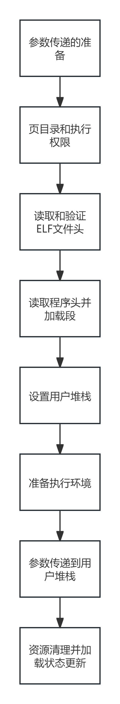
</p>


这个流程图展示了 `load` 函数的执行步骤。首先，函数会复制整个命令行参数，并计算参数的数量。接着，它会创建一个 `argv` 数组来存储这些参数，并将参数逐个解析并存储到 `argv` 数组中。

在解析完参数后，函数会分配并激活页目录，并尝试打开可执行文件。如果文件打开失败，函数会打印错误信息并返回。如果文件打开成功，函数会读取并验证可执行文件头，并根据文件头的信息读取程序头。

在读取程序头时，函数会检查每个段的类型，并根据段的类型决定是否加载该段。如果段是可加载的，函数会调用 `load_segment` 函数来加载段的内容。

在加载完所有段后，函数会设置用户栈，并将启动地址设置为可执行文件的入口点。最后，函数会将参数推送到栈上，并返回成功状态。

如果在任何步骤中出现错误，函数会释放已分配的资源，并返回失败状态。无论加载是否成功，函数都会通知等待的父进程子进程已完成加载。


```C

bool load(const char* file_name, void (**eip)(void), void** esp) {
  struct thread* t = thread_current();
  struct Elf32_Ehdr ehdr;
  struct file* file = NULL;
  off_t file_ofs;
  bool success = false;
  int i;

  //___START____: Code By Shaamer For Argument Passing PART 1/2

  //Make a copy of the entire command line
  char* file_copy = malloc(sizeof(char) * (strlen(file_name) + 1));
  strlcpy(file_copy, file_name, strlen(file_name) + 1);

  //Calculate the number of args
  int numspaces = 0;

  //Boolean protection against double+ spaces
  bool last = false;

  //Loop to count the number of spces = args -1
  for (unsigned i = 0; i < strlen(file_name); i++) {
    if (file_name[i] == ' ') {
      if (!last) {
        numspaces += 1;
        last = true;
      }
    } else {
      last = false;
    }
  }

  //Number of args
  int argc = numspaces + 1;

  //Creating the argv array
  char* argv[argc + 1];

  //Set the last element of argv to Null
  argv[argc] = NULL;

  //Counter to access argv array
  int counter = 0;

  // How to use Strtok_r on https://www.geeksforgeeks.org/strtok-strtok_r-functions-c-examples/
  char* saveptr = NULL;
  for (char* token_elem = strtok_r(file_copy, " ", &saveptr); token_elem != NULL;
       token_elem = strtok_r(NULL, " ", &saveptr)) {

    // Parse file, store in argv
    int len = strlen(token_elem);
    argv[counter] = (char*)malloc(sizeof(char) * (len + 1));
    strlcpy(argv[counter], token_elem, len + 1);
    counter++;
  }

  // test_name = argv[0];
  // printf(test_name);
  // if (test_name == NULL) {
  //   test_name = argv[0];
  //   printf("load:  %s\n", test_name);
  // }
  // else {
  //   // printf('test_name is not null');
  //   // printf('argv[0] is %s \n', argv[0]);
  //   // printf(t->test_name);
  //   printf("load:  %s\n", test_name);
  // }


  //Check if there are no arguments
  if (argc == 0) {
    //we passed in something empty
    success = false;
    printf("%s/n", "Didn't pass in anything");
    return success;
  }

  //Set the process name to be the name of the test/executable
  strlcpy(t->pcb->process_name, argv[0], strlen(argv[0]) + 1);

  /* PUSHING TO STACK IMPLEMENTED BELOW IN PART 2.*/

  //___END____: Code By Shaamer For Argument Passing PART 1/2

  /* Allocate and activate page directory. */
  t->pcb->pagedir = pagedir_create();
  if (t->pcb->pagedir == NULL)
    goto done;
  process_activate();

  /* Open executable file. */
  //SHAAMER CHANGED THE INPUT TO FILESYS_OPEN BELOW from file_name to argv[0]
  file = filesys_open(argv[0]);
  if (file == NULL) {
    printf("load: %s: open failed\n", file_name);
    goto done;
    //putting the executable into the pcb so we can close it in process exit
  } else {
    t->pcb->executable = file;
    file_deny_write(file);
  }

  /* Read and verify executable header. */
  if (file_read(file, &ehdr, sizeof ehdr) != sizeof ehdr ||
      memcmp(ehdr.e_ident, "\177ELF\1\1\1", 7) || ehdr.e_type != 2 || ehdr.e_machine != 3 ||
      ehdr.e_version != 1 || ehdr.e_phentsize != sizeof(struct Elf32_Phdr) || ehdr.e_phnum > 1024) {
    printf("load: %s: error loading executable\n", file_name);
    goto done;
  }

  /* Read program headers. */
  file_ofs = ehdr.e_phoff;
  for (i = 0; i < ehdr.e_phnum; i++) {
    struct Elf32_Phdr phdr;

    if (file_ofs < 0 || file_ofs > file_length(file))
      goto done;
    file_seek(file, file_ofs);

    if (file_read(file, &phdr, sizeof phdr) != sizeof phdr)
      goto done;
    file_ofs += sizeof phdr;
    switch (phdr.p_type) {
      case PT_NULL:
      case PT_NOTE:
      case PT_PHDR:
      case PT_STACK:
      default:
        /* Ignore this segment. */
        break;
      case PT_DYNAMIC:
      case PT_INTERP:
      case PT_SHLIB:
        goto done;
      case PT_LOAD:
        if (validate_segment(&phdr, file)) {
          bool writable = (phdr.p_flags & PF_W) != 0;
          uint32_t file_page = phdr.p_offset & ~PGMASK;
          uint32_t mem_page = phdr.p_vaddr & ~PGMASK;
          uint32_t page_offset = phdr.p_vaddr & PGMASK;
          uint32_t read_bytes, zero_bytes;
          if (phdr.p_filesz > 0) {
            /* Normal segment.
                     Read initial part from disk and zero the rest. */
            read_bytes = page_offset + phdr.p_filesz;
            zero_bytes = (ROUND_UP(page_offset + phdr.p_memsz, PGSIZE) - read_bytes);
          } else {
            /* Entirely zero.
                     Don't read anything from disk. */
            read_bytes = 0;
            zero_bytes = ROUND_UP(page_offset + phdr.p_memsz, PGSIZE);
          }
          if (!load_segment(file, file_page, (void*)mem_page, read_bytes, zero_bytes, writable))
            goto done;
        } else
          goto done;
        break;
    }
  }

  /* Set up stack. */
  if (!setup_stack(esp))
    goto done;

  /* Start address. */
  *eip = (void (*)(void))ehdr.e_entry;

  //___START____: Code By Shaamer For Argument Passing PART 2/2

  //Push the actual arguments onto the stack in reverse order
  for (int k = argc - 1; k >= 0; k--) {
    *esp -= strlen(argv[k]) + 1;
    memcpy(*esp, argv[k], strlen(argv[k]) + 1);
    argv[k] = *esp;
  }
  /*START STACK ALIGN*/
  // arg pointers + nullpointer + **argv + argc
  int numpointers = 3 + argc;
  int amount_to_decrement = ((unsigned)*esp - numpointers * 4) % 16;
  *esp -= amount_to_decrement;
  /*END STACK ALIGN*/

  /*push addresses of arguments in reverse order*/
  for (int k = argc; k >= 0; k--) {
    *esp -= 4;
    *(uint32_t*)*esp = (int)(uint32_t*)argv[k];
  }

  /*push **argv */
  *esp -= 4;
  *(uint32_t*)*esp = (int)(*esp + 4);

  /*push argc */
  *esp -= 4;
  *(uint32_t*)*esp = argc;

  /*push fake return address */
  *esp -= 4;
  *(uint32_t*)*esp = 0;

  //___END____: Code By Shaamer For Argument Passing PART 2/2

  success = true;

done:
  /* We arrive here whether the load is successful or not. */
  //Commenting this out here so we can close the executable in process exit and prevent writing to the executable
  //during the entire process
  //file_close(file);

  //Free resources if the load fails
  if (!success) {
    free(file_copy);
    for (int i = 0; i < counter; i++) {
      free(argv[i]);
    }
  }

  //store loads success status in the threads metadata
  t->shared->load_check = success;
  //up load semaphore for process_execute to continue executing
  sema_up(&(t->shared->load));
  return success;
}

```

为了实现 `process_wait` 函数，我们需要确保它能够等待具有特定 PID 的子进程终止，并返回该子进程的退出状态。如果子进程由于异常被内核终止，则返回 -1。此外，如果提供的 PID 无效，或者它不是调用进程的子进程，或者已经对该 PID 成功调用过 `process_wait`，则函数应立即返回 -1，而无需等待。

以下是 `process_wait` 函数的实现代码：

```C
/* Waits for a child process with PID child_pid to terminate and returns its exit status.
  Returns -1 if the process was terminated by the kernel (i.e., killed due to an exception).
  Returns -1 immediately if child_pid is invalid, not a child of the calling process, or if process_wait() has already been successfully called for the given PID.

  This function will be implemented in Problem 2-2. Currently, it does nothing. */
int process_wait(pid_t child_pid) {
  struct thread* t = thread_current();
  struct list_elem* e;

  // Iterate through the child list and search for the child with the given pid
  if (!list_empty(t->pcb->child)) {
   for (e = list_begin(t->pcb->child); e != list_end(t->pcb->child); e = list_next(e)) {
    metadata_t* cur_md = list_entry(e, metadata_t, elem);
    if (cur_md->tid == child_pid) {
      // Wait until the child has finished by downing the finish semaphore
      sema_down(&(cur_md->finish));
      // Store the exit code from the child's metadata
      int exit = cur_md->exitcode;
      // Acquire lock to decrement ref_cnt to avoid race conditions
      lock_acquire(&(cur_md->tlock));
      cur_md->ref_cnt -= 1;
      int temp = cur_md->ref_cnt;
      lock_release(&(cur_md->tlock));
      // Remove the waited child from the parent's child list
      list_remove(e);
      // If ref_cnt is 0, free the metadata
      if (temp == 0) {
       free(cur_md);
      }
      // Return -1 if the exit code is -2 to handle errors properly
      return (exit == -2) ? -1 : exit;
    }
   }
  }
  return -1;
}
```

#### 任务二：Process Control Syscalls

为了实现新的系统调用，首先需要在 Pintos 中添加对以下系统调用的支持：`practice、halt、exec` 和 `wait`。每个系统调用在 pintos/src/lib/user/sycall.c 的用户级库中都有一个对应的函数，这些函数负责准备系统调用参数并处理向内核模式的转移。内核的系统调用处理程序位于 pintos/src/userprog/sycall.c 中。

实践系统调用（practice）只是简单地将它的第一个参数加 1，并返回结果，这样可以让你练习编写一个系统调用处理程序。halt 系统调用将关闭系统。exec 系统调用将使用 process_execute() 启动一个新程序。在 Pintos 中没有 fork 系统调用，exec 系统调用类似于在 Linux 中调用 fork 系统调用，然后在子进程中立即调用 execve 系统调用。wait 系统调用将等待特定的子进程退出。

为了实现这些系统调用，首先需要一种方法来安全地读写用户进程虚拟地址空间中的内存。系统调用参数位于用户进程的堆栈上，紧挨着用户进程堆栈指针的上方。当你尝试解引用无效或空指针时，不允许出现内核崩溃。例如，当用户程序进行系统调用时，如果堆栈指针无效，那么内核在试图从堆栈中读取系统调用参数时不应该崩溃。此外，一些系统调用参数是指向用户进程地址空间内缓冲区的指针，这些缓冲区指针也可能无效。

需要优雅地处理由于无效内存访问而无法完成系统调用的情况。这些类型的内存错误包括空指针、无效指针（指向未映射的内存位置）或指向内核虚拟地址空间的指针。注意，一个 4 字节的内存区域（比如一个 32 位整数）可能由 2 个字节的有效内存和 2 个字节的无效内存组成，如果内存位于页面边界的话。应该通过终止用户进程来处理这些情况。建议在实现任何其他系统调用功能之前测试这部分代码。有关更多信息，请参阅访问用户内存。

需要在 `thread.h` 中添加以下字段，代码如下：

```C
/* 元数据结构体，在线程和其父进程之间共享，存储在线程结构体中 */
typedef struct metadata {
  tid_t tid;               // 用于标识我们正在处理的子进程
  struct lock tlock;       // 用于实现原子操作
  int ref_cnt;             // 仍然引用共享数据的活动进程数量
  int exitcode;            // 存储子进程退出时的退出码
  struct semaphore load;   // 用于在进程之间同步加载
  bool load_check;         // 用于判断是否加载成功
  struct semaphore finish; // 用于同步退出函数
  struct list_elem elem;   // 使其成为一个 pintos 列表
  char* file_copy;         // 用于在传递给 start_process 时存储命令行参数
} metadata_t;
```

为了确保指针的有效性，我们需要对 `is_valid_ptr` 函数进行一些修改。这个函数的主要任务是防止内核崩溃。首先，它会检查指针是否为空。如果指针为空，那么显然它是无效的。接下来，函数会检查内存地址范围是否在用户空间内。用户空间的地址范围是有限的，如果指针指向内核空间或者超出了用户空间的范围，那么这个指针也是无效的。最后，函数会检查内存地址是否在映射内存中。即使指针在用户空间内，如果它指向的内存地址没有被映射，那么这个指针仍然是无效的。通过这些检查，我们可以确保指针的有效性，从而防止内核崩溃。代码如下所示：

```C
// 检查指针是否有效
bool is_valid_ptr(char* ptr) {
  struct thread* t = thread_current();

  // 检查指针是否为空
  if (ptr == NULL) {
    return false;
  }
  // 检查整个内存地址是否在用户空间中
  if (!is_user_vaddr(ptr) || !is_user_vaddr(ptr + 3)) {
    return false;
  }

  // 检查整个内存地址是否在映射的内存中
  if (pagedir_get_page(t->pcb->pagedir, ptr) == NULL ||
      pagedir_get_page(t->pcb->pagedir, (ptr + 3)) == NULL) {
    return false;
  }
  return true;
}
```

接下来，我们需要修改 `syscall_handler` 函数。实际上，`syscall.c` 文件中主要就是这个函数，它的主要作用是处理以下四个系统调用：`SYS_HALT`、`SYS_EXIT`、`SYS_EXEC` 和 `SYS_WAIT`。这个函数比较长，下面是它的流程图：
<p align="center">
  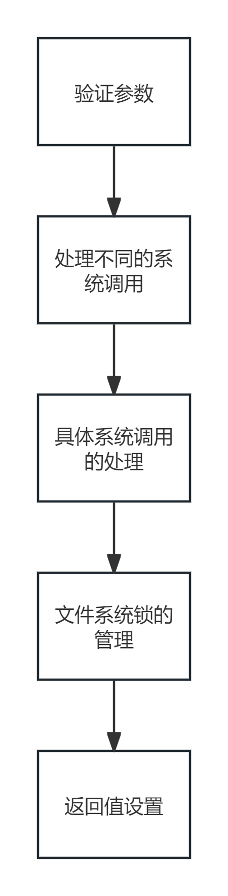
</p>


代码如下所示：

```C
static void syscall_handler(struct intr_frame* f UNUSED) {
  // This is the exit code we set for exiting due to an exception
  // Check if we have a valid stack pointer
  if (!is_valid_ptr((char*)f->esp)) {
    process_exit(-2);
  }

  uint32_t* args = ((uint32_t*)f->esp);

  /*
   * 如果取消注释以下的打印语句，那么每当一个进程进入系统调用时，它将打印出系统调用号。
   * 在调试时可能会有用，但会导致测试失败，因此不应包含在最终提交中。
   */

  /* printf("System call number: %d\n", args[0]); */
  // Check if arg[0] is in a valid memory region
  if (!is_valid_int(&args[0])) {
    // Exit as an exception/error
    process_exit(-2);
  }


  if (args[0] == SYS_EXIT) {
    // Ensure integer arguments are valid
    if (!is_valid_int(&args[1])) {
      // Exit as an exception/error
      process_exit(-2);
    }
    // Set the return value to the exit code
    f->eax = args[1];
    printf("%s: exit(%d)\n", thread_current()->pcb->process_name, args[1]);
    process_exit(args[1]);
  } else if (args[0] == SYS_EXEC) {
    // Check if the pointer is valid
    if (!is_valid_ptr((char*)args[1])) {
      // Exit as an exception/error
      process_exit(-2);
    }
    // Store cmd_line in a variable to pass to process_execute
    const char* cmnd_line = (const char*)args[1];
    // Store the pid returned by process_execute in eax and return
    f->eax = process_execute(cmnd_line);
    return;
  } else if (args[0] == SYS_WAIT) {
    if (!is_valid_int(&args[1])) {
      // Exit as an exception/error
      process_exit(-2);
    }
    // Store the exit code returned by process_wait in eax and return
    f->eax = process_wait((pid_t)args[1]);
    return;
  } else if (args[0] == SYS_WRITE) {
    // Get the current thread so we can access pcb
    struct thread* t = thread_current();

    // Acquire the global file system lock
    lock_acquire(t->pcb->filesys_lock);

    // Check if the pointer is valid
    if (!is_valid_ptr((char*)args[2]) || !is_valid_int(&args[1]) || !is_valid_int(&args[3])) {
      // Release the file system lock and exit
      lock_release(t->pcb->filesys_lock);

      // Exit as an exception/error
      process_exit(-2);
    }

    // Get the file descriptor passed into the system call
    int fd = args[1];

    // Get the buffer pointer to write to
    void* buffer = (void*)args[2];

    // Get the number of bytes to write
    // Possible error: not sure if we need to check if this is zero
    unsigned size = args[3];

    // Check if the file descriptor is valid. Cannot write to stdin
    if (fd <= 0) {
      // Set the return value
      f->eax = -1;
      // Release the file system lock
      lock_release(t->pcb->filesys_lock);
      return;
    }

    // Check if writing to stdout
    if (fd == 1) {

      if (size <= 200) {
        // Write the entire buffer in one call to putbuf
        putbuf(buffer, size);
      } else {
        // Split the buffer into smaller chunks and write each chunk until the entire buffer is written
        unsigned offset = 0;
        while (offset < size) {
          int chunk_size = size - offset;
          if (chunk_size > 200) {
            chunk_size = 200;
          }
          putbuf(buffer + offset, chunk_size);
          offset += chunk_size;
        }
      }

      // Set the return value
      f->eax = size;

      // Release the file system lock
      lock_release(t->pcb->filesys_lock);
      return;

      // Otherwise we are writing to a file descriptor
    } else {

      // Get the entry in the file descriptor table and check if it exists
      file_descriptor_t* table_entry = find_fd(t->pcb->file_descriptor_table, fd);
      if (table_entry == NULL) {
        // Set the return value
        f->eax = -1;
        // Release the file system lock
        lock_release(t->pcb->filesys_lock);
        return;
      }

      // Get the open file from the table entry
      struct file* open_file = table_entry->open_file;

      // Variable to hold the number of bytes written
      int bytes_written = 0;
      if (size <= 200) {
        // Write the entire buffer in one call to file_write
        bytes_written = file_write(open_file, buffer, size);
      } else {
        // Split the buffer into smaller chunks and iterate writing until complete
        unsigned offset = 0;
        while (offset < size) {
          int chunk_size = size - offset;
          if (chunk_size > 200) {
            chunk_size = 200;
          }
          bytes_written += file_write(open_file, buffer + offset, chunk_size);
          offset += chunk_size;
        }
      }

      // Set the return value
      f->eax = bytes_written;

      // Release the file system lock
      lock_release(t->pcb->filesys_lock);

      return;
    }
  }
  // Implement practice system call
  else if (args[0] == SYS_PRACTICE) {
    // Increment argument 1 and store in eax
    f->eax = args[1] + 1;
    return;
  }
  // Implement Halt system call
  else if (args[0] == SYS_HALT) {
    // Call shutdown_power_off()
    shutdown_power_off();
  }
  
  if (args[0] == SYS_CREATE) {
    struct thread* t = thread_current();
    lock_acquire(t->pcb->filesys_lock);

    if (!is_valid_ptr((char*)args[1]) || !is_valid_int(&args[2])) {
      lock_release(t->pcb->filesys_lock);
      process_exit(-2);
    }

    const char* file = (const char*)args[1];

    if (strlen(file) > 14) {
      f->eax = false;
      lock_release(t->pcb->filesys_lock);
      return;
    }

    unsigned size = args[2];
    bool success = filesys_create(file, size);
    f->eax = success;
    lock_release(t->pcb->filesys_lock);
    return;

  } else if (args[0] == SYS_REMOVE) {
    struct thread* t = thread_current();
    lock_acquire(t->pcb->filesys_lock);

    void* ptr = (void*)args[1];
    if (!is_valid_ptr((char*)ptr)) {
      lock_release(t->pcb->filesys_lock);
      process_exit(-2);
    }
    const char* file = (const char*)ptr;
    bool success = filesys_remove(file);
    f->eax = success;
    lock_release(t->pcb->filesys_lock);
    return;

  } else if (args[0] == SYS_OPEN) {
    struct thread* t = thread_current();
    lock_acquire(t->pcb->filesys_lock);

    void* ptr = (void*)args[1];
    if (!is_valid_ptr((char*)ptr)) {
      lock_release(t->pcb->filesys_lock);
      process_exit(-2);
    }
    const char* file = (const char*)ptr;
    file_descriptor_t* exists = find_filename(t->pcb->file_descriptor_table, file);
    int newfd;

    if (exists == NULL) {
      newfd = t->pcb->fd_next++;
      struct file* open_file = filesys_open(file);
      if (open_file == NULL) {
        f->eax = -1;
        lock_release(t->pcb->filesys_lock);
        return;
      }
      add_fd(t->pcb->file_descriptor_table, newfd, open_file, file);
    } else {
      newfd = t->pcb->fd_next++;
      struct file* open_file = file_reopen(exists->open_file);
      if (open_file == NULL) {
        f->eax = -1;
        lock_release(t->pcb->filesys_lock);
        return;
      }
      add_fd(t->pcb->file_descriptor_table, newfd, open_file, file);
    }

    f->eax = newfd;
    lock_release(t->pcb->filesys_lock);
    return;

  } else if (args[0] == SYS_SEEK) {
    struct thread* t = thread_current();
    lock_acquire(t->pcb->filesys_lock);

    if (!is_valid_int(&args[1]) || !is_valid_int(&args[2])) {
      lock_release(t->pcb->filesys_lock);
      process_exit(-2);
    }

    int fd = args[1];
    file_descriptor_t* found = find_fd(t->pcb->file_descriptor_table, fd);

    if (found == NULL) {
      lock_release(t->pcb->filesys_lock);
      return;
    } else {
      unsigned size = args[2];
      file_seek(found->open_file, size);
      lock_release(t->pcb->filesys_lock);
      return;
    }
  } else if (args[0] == SYS_TELL) {
    struct thread* t = thread_current();
    lock_acquire(t->pcb->filesys_lock);

    if (!is_valid_int(&args[1])) {
      lock_release(t->pcb->filesys_lock);
      process_exit(-2);
    }

    int fd = args[1];
    file_descriptor_t* found = find_fd(t->pcb->file_descriptor_table, fd);

    if (found == NULL) {
      f->eax = -1;
      lock_release(t->pcb->filesys_lock);
      return;
    } else {
      off_t tell = file_tell(found->open_file);
      f->eax = tell;
      lock_release(t->pcb->filesys_lock);
      return;
    }
  } else if (args[0] == SYS_CLOSE) {
    if (!is_valid_int(&args[1])) {
      process_exit(-2);
    }
    f->eax = process_file_close((int)args[1]);
    return;
  } else if (args[0] == SYS_FILESIZE) {
    struct thread* t = thread_current();
    lock_acquire(t->pcb->filesys_lock);

    if (!is_valid_int(&args[1])) {
      lock_release(t->pcb->filesys_lock);
      process_exit(-2);
    }

    int fd = args[1];
    file_descriptor_t* found = find_fd(t->pcb->file_descriptor_table, fd);

    if (found == NULL) {
      f->eax = -1;
      lock_release(t->pcb->filesys_lock);
      return;
    } else {
      off_t len = file_length(found->open_file);
      f->eax = len;
      lock_release(t->pcb->filesys_lock);
      return;
    }
  } else if (args[0] == SYS_READ) {
    struct thread* t = thread_current();
    lock_acquire(t->pcb->filesys_lock);

    if (!is_valid_ptr((char*)args[2]) || !is_valid_int(&args[1]) || !is_valid_int(&args[3])) {
      lock_release(t->pcb->filesys_lock);
      process_exit(-2);
    }

    int fd = args[1];
    unsigned size = args[3];

    if (fd == 1 || fd < 0) {
      f->eax = -1;
      lock_release(t->pcb->filesys_lock);
      return;
    }

    if (fd == 0) {
      char* buffer = (char*)args[2];
      for (unsigned i = 0; i < size; i++) {
        buffer[i] = input_getc();
      }
      f->eax = size;
      lock_release(t->pcb->filesys_lock);
      return;
    } else {
      void* buffer = (void*)args[2];
      file_descriptor_t* table_entry = find_fd(t->pcb->file_descriptor_table, fd);
      if (table_entry == NULL) {
        f->eax = -1;
        lock_release(t->pcb->filesys_lock);
        return;
      }

      struct file* open_file = table_entry->open_file;
      int read = file_read(open_file, buffer, size);
      f->eax = read;
      lock_release(t->pcb->filesys_lock);
      return;
    }
  } else if (args[0] == SYS_COMPUTE_E) {
    int n = args[1];
    if (n < 0) {
      process_exit(-2);
    } else {
      f->eax = sys_sum_to_e(n);
      return;
    }
  }
}
```

#### 任务三：File Operation Syscalls

除了进程控制系统调用之外，还需要实现一系列文件操作系统调用，包括创建、删除、打开、获取文件大小、读取、写入、查找、获取文件位置和关闭文件。Pintos已经提供了一个基本的文件系统，我们只需要调用文件系统库中的适当函数来实现这些系统调用。你不需要自己实现这些文件操作的底层逻辑。

需要注意的是，Pintos文件系统并不是线程安全的。因此，我们必须确保在进行文件操作系统调用时，不会有多个线程并发地调用文件系统函数。在项目3中，我们将向Pintos文件系统添加更复杂的同步机制，但在这个项目中，我们可以使用全局锁来确保文件系统操作的线程安全。具体来说，可以将整个文件系统代码视为一个单独的关键部分，通过全局锁来保护它。建议避免在这个项目中修改filesys目录中的内容。

当用户进程运行时，必须确保没有人可以修改磁盘上的可执行文件。`rox`测试将确保我们拒绝对当前运行的程序文件进行写操作。函数`file_deny_write()`和`file_allow_write()`可以帮助实现这一特性。拒绝对支持活动进程的可执行文件进行写操作是非常重要的，因为操作系统可能会延迟从文件中加载代码页，或者可能会分页出一些代码页，然后从文件中重新加载它们。虽然在Pintos中，从技术上讲，这不是一个问题，因为文件在执行开始之前被完整地加载到内存中，并且Pintos不实现任何类型的请求分页，但仍然需要实现这一点，因为这是一个良好的实践。

类似于实验二，我们需要对`syscall.c`中的`syscall_handler`函数进行修改，以实现题目要求的系统调用，包括`SYS_CREATE`、`SYS_REMOVE`、`SYS_OPEN`、`SYS_FILESIZE`、`SYS_READ`、`SYS_WRITE`、`SYS_SEEK`、`SYS_TELL`和`SYS_CLOSE`。函数流程图可以参考任务二，代码如下所示：

在`load`函数中，需要添加对`file_deny_write`的调用，以保证用户进程的可执行文件被写保护。同时，还需要添加`file_allow_write`的调用，以允许对可执行文件的写操作。

```C
/* Opens the file with the given NAME.
   Returns the new file if successful or a null pointer
   otherwise.
   Fails if no file named NAME exists,
   or if an internal memory allocation fails. */
struct file* filesys_open(const char* name) {
  struct dir* dir = dir_open_root();
  struct inode* inode = NULL;

  if (dir != NULL)
    dir_lookup(dir, name, &inode);
  dir_close(dir);

  return file_open(inode);
}
```

与实验二中类似，syscall_handler函数代码如下：

```C
// Function to check if integers passed into the kernel are valid
bool is_valid_int(uint32_t* ptr) {
  return is_valid_ptr(((char*)ptr)) && is_valid_ptr(((char*)ptr) + 3);
}

static void syscall_handler(struct intr_frame* f UNUSED) {
  // This is the exit code we set for exiting due to an exception
  // Check if we have a valid stack pointer
  if (!is_valid_ptr((char*)f->esp)) {
    process_exit(-2);
  }

  uint32_t* args = ((uint32_t*)f->esp);

  /*
   * 如果取消注释以下的打印语句，那么每当一个进程进入系统调用时，它将打印出系统调用号。
   * 在调试时可能会有用，但会导致测试失败，因此不应包含在最终提交中。
   */

  /* printf("System call number: %d\n", args[0]); */
  // Check if arg[0] is in a valid memory region
  if (!is_valid_int(&args[0])) {
    // Exit as an exception/error
    process_exit(-2);
  }


  if (args[0] == SYS_EXIT) {
    // Ensure integer arguments are valid
    if (!is_valid_int(&args[1])) {
      // Exit as an exception/error
      process_exit(-2);
    }
    // Set the return value to the exit code
    f->eax = args[1];
    printf("%s: exit(%d)\n", thread_current()->pcb->process_name, args[1]);
    process_exit(args[1]);
  } else if (args[0] == SYS_EXEC) {
    // Check if the pointer is valid
    if (!is_valid_ptr((char*)args[1])) {
      // Exit as an exception/error
      process_exit(-2);
    }
    // Store cmd_line in a variable to pass to process_execute
    const char* cmnd_line = (const char*)args[1];
    // Store the pid returned by process_execute in eax and return
    f->eax = process_execute(cmnd_line);
    return;
  } else if (args[0] == SYS_WAIT) {
    if (!is_valid_int(&args[1])) {
      // Exit as an exception/error
      process_exit(-2);
    }
    // Store the exit code returned by process_wait in eax and return
    f->eax = process_wait((pid_t)args[1]);
    return;
  } else if (args[0] == SYS_WRITE) {
    // Get the current thread so we can access pcb
    struct thread* t = thread_current();

    // Acquire the global file system lock
    lock_acquire(t->pcb->filesys_lock);

    // Check if the pointer is valid
    if (!is_valid_ptr((char*)args[2]) || !is_valid_int(&args[1]) || !is_valid_int(&args[3])) {
      // Release the file system lock and exit
      lock_release(t->pcb->filesys_lock);

      // Exit as an exception/error
      process_exit(-2);
    }

    // Get the file descriptor passed into the system call
    int fd = args[1];

    // Get the buffer pointer to write to
    void* buffer = (void*)args[2];

    // Get the number of bytes to write
    // Possible error: not sure if we need to check if this is zero
    unsigned size = args[3];

    // Check if the file descriptor is valid. Cannot write to stdin
    if (fd <= 0) {
      // Set the return value
      f->eax = -1;
      // Release the file system lock
      lock_release(t->pcb->filesys_lock);
      return;
    }

    // Check if writing to stdout
    if (fd == 1) {

      if (size <= 200) {
        // Write the entire buffer in one call to putbuf
        putbuf(buffer, size);
      } else {
        // Split the buffer into smaller chunks and write each chunk until the entire buffer is written
        unsigned offset = 0;
        while (offset < size) {
          int chunk_size = size - offset;
          if (chunk_size > 200) {
            chunk_size = 200;
          }
          putbuf(buffer + offset, chunk_size);
          offset += chunk_size;
        }
      }

      // Set the return value
      f->eax = size;

      // Release the file system lock
      lock_release(t->pcb->filesys_lock);
      return;

      // Otherwise we are writing to a file descriptor
    } else {

      // Get the entry in the file descriptor table and check if it exists
      file_descriptor_t* table_entry = find_fd(t->pcb->file_descriptor_table, fd);
      if (table_entry == NULL) {
        // Set the return value
        f->eax = -1;
        // Release the file system lock
        lock_release(t->pcb->filesys_lock);
        return;
      }

      // Get the open file from the table entry
      struct file* open_file = table_entry->open_file;

      // Variable to hold the number of bytes written
      int bytes_written = 0;
      if (size <= 200) {
        // Write the entire buffer in one call to file_write
        bytes_written = file_write(open_file, buffer, size);
      } else {
        // Split the buffer into smaller chunks and iterate writing until complete
        unsigned offset = 0;
        while (offset < size) {
          int chunk_size = size - offset;
          if (chunk_size > 200) {
            chunk_size = 200;
          }
          bytes_written += file_write(open_file, buffer + offset, chunk_size);
          offset += chunk_size;
        }
      }

      // Set the return value
      f->eax = bytes_written;

      // Release the file system lock
      lock_release(t->pcb->filesys_lock);

      return;
    }
  }
  // Implement practice system call
  else if (args[0] == SYS_PRACTICE) {
    // Increment argument 1 and store in eax
    f->eax = args[1] + 1;
    return;
  }
  // Implement Halt system call
  else if (args[0] == SYS_HALT) {
    // Call shutdown_power_off()
    shutdown_power_off();
  }
  
  if (args[0] == SYS_CREATE) {
    struct thread* t = thread_current();
    lock_acquire(t->pcb->filesys_lock);

    if (!is_valid_ptr((char*)args[1]) || !is_valid_int(&args[2])) {
      lock_release(t->pcb->filesys_lock);
      process_exit(-2);
    }

    const char* file = (const char*)args[1];

    if (strlen(file) > 14) {
      f->eax = false;
      lock_release(t->pcb->filesys_lock);
      return;
    }

    unsigned size = args[2];
    bool success = filesys_create(file, size);
    f->eax = success;
    lock_release(t->pcb->filesys_lock);
    return;

  } else if (args[0] == SYS_REMOVE) {
    struct thread* t = thread_current();
    lock_acquire(t->pcb->filesys_lock);

    void* ptr = (void*)args[1];
    if (!is_valid_ptr((char*)ptr)) {
      lock_release(t->pcb->filesys_lock);
      process_exit(-2);
    }
    const char* file = (const char*)ptr;
    bool success = filesys_remove(file);
    f->eax = success;
    lock_release(t->pcb->filesys_lock);
    return;

  } else if (args[0] == SYS_OPEN) {
    struct thread* t = thread_current();
    lock_acquire(t->pcb->filesys_lock);

    void* ptr = (void*)args[1];
    if (!is_valid_ptr((char*)ptr)) {
      lock_release(t->pcb->filesys_lock);
      process_exit(-2);
    }
    const char* file = (const char*)ptr;
    file_descriptor_t* exists = find_filename(t->pcb->file_descriptor_table, file);
    int newfd;

    if (exists == NULL) {
      newfd = t->pcb->fd_next++;
      struct file* open_file = filesys_open(file);
      if (open_file == NULL) {
        f->eax = -1;
        lock_release(t->pcb->filesys_lock);
        return;
      }
      add_fd(t->pcb->file_descriptor_table, newfd, open_file, file);
    } else {
      newfd = t->pcb->fd_next++;
      struct file* open_file = file_reopen(exists->open_file);
      if (open_file == NULL) {
        f->eax = -1;
        lock_release(t->pcb->filesys_lock);
        return;
      }
      add_fd(t->pcb->file_descriptor_table, newfd, open_file, file);
    }

    f->eax = newfd;
    lock_release(t->pcb->filesys_lock);
    return;

  } else if (args[0] == SYS_SEEK) {
    struct thread* t = thread_current();
    lock_acquire(t->pcb->filesys_lock);

    if (!is_valid_int(&args[1]) || !is_valid_int(&args[2])) {
      lock_release(t->pcb->filesys_lock);
      process_exit(-2);
    }

    int fd = args[1];
    file_descriptor_t* found = find_fd(t->pcb->file_descriptor_table, fd);

    if (found == NULL) {
      lock_release(t->pcb->filesys_lock);
      return;
    } else {
      unsigned size = args[2];
      file_seek(found->open_file, size);
      lock_release(t->pcb->filesys_lock);
      return;
    }
  } else if (args[0] == SYS_TELL) {
    struct thread* t = thread_current();
    lock_acquire(t->pcb->filesys_lock);

    if (!is_valid_int(&args[1])) {
      lock_release(t->pcb->filesys_lock);
      process_exit(-2);
    }

    int fd = args[1];
    file_descriptor_t* found = find_fd(t->pcb->file_descriptor_table, fd);

    if (found == NULL) {
      f->eax = -1;
      lock_release(t->pcb->filesys_lock);
      return;
    } else {
      off_t tell = file_tell(found->open_file);
      f->eax = tell;
      lock_release(t->pcb->filesys_lock);
      return;
    }
  } else if (args[0] == SYS_CLOSE) {
    if (!is_valid_int(&args[1])) {
      process_exit(-2);
    }
    f->eax = process_file_close((int)args[1]);
    return;
  } else if (args[0] == SYS_FILESIZE) {
    struct thread* t = thread_current();
    lock_acquire(t->pcb->filesys_lock);

    if (!is_valid_int(&args[1])) {
      lock_release(t->pcb->filesys_lock);
      process_exit(-2);
    }

    int fd = args[1];
    file_descriptor_t* found = find_fd(t->pcb->file_descriptor_table, fd);

    if (found == NULL) {
      f->eax = -1;
      lock_release(t->pcb->filesys_lock);
      return;
    } else {
      off_t len = file_length(found->open_file);
      f->eax = len;
      lock_release(t->pcb->filesys_lock);
      return;
    }
  } else if (args[0] == SYS_READ) {
    struct thread* t = thread_current();
    lock_acquire(t->pcb->filesys_lock);

    if (!is_valid_ptr((char*)args[2]) || !is_valid_int(&args[1]) || !is_valid_int(&args[3])) {
      lock_release(t->pcb->filesys_lock);
      process_exit(-2);
    }

    int fd = args[1];
    unsigned size = args[3];

    if (fd == 1 || fd < 0) {
      f->eax = -1;
      lock_release(t->pcb->filesys_lock);
      return;
    }

    if (fd == 0) {
      char* buffer = (char*)args[2];
      for (unsigned i = 0; i < size; i++) {
        buffer[i] = input_getc();
      }
      f->eax = size;
      lock_release(t->pcb->filesys_lock);
      return;
    } else {
      void* buffer = (void*)args[2];
      file_descriptor_t* table_entry = find_fd(t->pcb->file_descriptor_table, fd);
      if (table_entry == NULL) {
        f->eax = -1;
        lock_release(t->pcb->filesys_lock);
        return;
      }

      struct file* open_file = table_entry->open_file;
      int read = file_read(open_file, buffer, size);
      f->eax = read;
      lock_release(t->pcb->filesys_lock);
      return;
    }
  } else if (args[0] == SYS_COMPUTE_E) {
    int n = args[1];
    if (n < 0) {
      process_exit(-2);
    } else {
      f->eax = sys_sum_to_e(n);
      return;
    }
  }
}
```

至此，可以通过判题机上96个测试用例，最终取得了97分的成绩

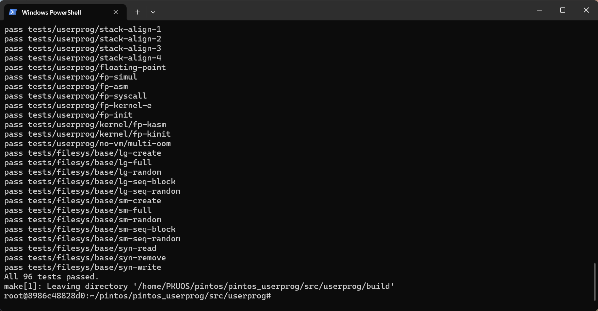


### User Programs实验总结

这个项目的核心任务是实现用户程序的参数传递和系统调用功能，这不仅考验了我的编程能力，也让我对操作系统的内部机制有了更深刻的理解。首先，我需要实现参数传递功能，使得调用`process_execute("ls -ahl")`时能够正确传递参数给用户程序。这个过程让我意识到，参数传递不仅仅是简单的字符串处理，还涉及到内存管理和堆栈操作。接下来，我实现了一系列系统调用，包括`practice、halt、exec` 和 `wait`，这些系统调用的实现让我对操作系统的系统调用机制有了更深入的理解。在实现文件操作系统调用时，我遇到了更大的挑战，因为Pintos的文件系统并不是线程安全的。为了解决这个问题，我引入了全局锁来保护文件系统操作。通过不断尝试和调整，我终于实现了线程安全的文件操作系统调用。整个项目的完成让我收获颇丰，不仅提升了我的编程能力，更让我对操作系统的内部机制有了更全面的理解。每一次调试和优化都是一次学习的机会，每一个问题的解决都是一次成长的经历。这个项目让我深刻体会到，操作系统的设计和实现是一项复杂而精细的工作，需要不断学习和探索。总的来说，Project 3 User Programs不仅让我掌握了操作系统的基本原理和实现方法，更让我在实践中提升了解决问题的能力和编程技巧。这段经历将成为我未来学习和工作的宝贵财富。

### **课设总结与心得**

在完成整个Pintos项目的过程中，我经历了一段充满挑战和收获的旅程。这个项目不仅考验了我的编程能力，还让我对操作系统的内部机制有了更深刻的理解。

刚开始接触Pintos时，我感到有些迷茫。操作系统的概念虽然在课堂上有所涉及，但真正动手实现时，才发现其中的复杂性远超想象。每一个模块的实现都需要仔细推敲和反复调试，稍有不慎就会导致系统崩溃或功能异常。

在实现用户程序的参数传递功能时，我遇到了不少困难。参数传递不仅仅是简单的字符串处理，还涉及到内存管理和堆栈操作。为了确保参数能够正确传递给用户程序，我花了大量时间调试和优化代码。每一次调试成功，都是一次巨大的成就感。

系统调用的实现也是一个巨大的挑战。为了实现practice、halt、exec和wait等系统调用，我需要深入理解操作系统的系统调用机制。特别是在实现exec系统调用时，我需要确保新进程能够正确加载和执行用户程序。这个过程中，我遇到了许多意想不到的问题，比如内存访问错误和进程同步问题。通过查阅资料和反复调试，我逐步解决了这些问题，最终实现了稳定可靠的系统调用功能。

文件操作系统调用的实现让我对并发编程有了更深刻的理解。Pintos的文件系统并不是线程安全的，为了解决这个问题，我引入了全局锁来保护文件系统操作。通过不断尝试和调整，我终于实现了线程安全的文件操作系统调用。这一过程中，我深刻体会到并发编程的复杂性和重要性。

整个项目的完成让我收获颇丰。不仅提升了我的编程能力，更让我对操作系统的内部机制有了更全面的理解。每一次调试和优化都是一次学习的机会，每一个问题的解决都是一次成长的经历。这个项目让我深刻体会到，操作系统的设计和实现是一项复杂而精细的工作，需要不断学习和探索。

纵观这整个项目，我对操作系统的基本概念、基本理论和典型方法有了更深刻的理解。通过实现用户程序的参数传递和系统调用功能，我学会了如何建立模型，并利用基本原理解决复杂的工程问题。这个过程中，我设计了实验方案，并不断调整和优化，最终实现了稳定可靠的系统功能。

最后，我也认识到操作系统设计对环境和社会可持续发展的重要性。通过引入线程安全的文件系统操作，我不仅提升了系统的稳定性和可靠性，也为未来的可持续发展奠定了基础。

总体而言，这个项目不仅让我掌握了操作系统的基本原理和实现方法，更让我在实践中提升了解决问题的能力和编程技巧。这段经历将成为我未来学习和工作的宝贵财富。通过这个项目，我不仅学到了知识，更收获了信心和成就感。
